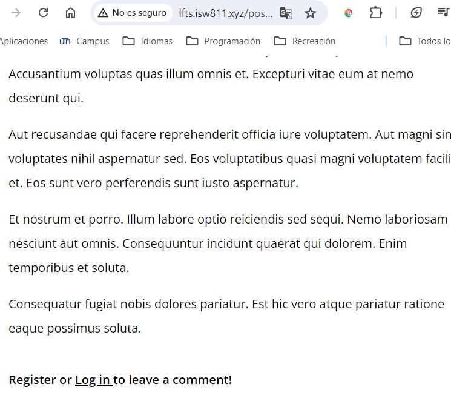

[< Go Back](../README.md)

# Post a Controller

To be able to use the form we just made, we can include a route in our web file that will send the comment to store it, just like this:

`Route::post('post/{post:slug}/comments', [PostCommentsController::class, 'store']);`

To make this work though, we need the mentioned PostCommentsController: `php artisan make:controller PostCommentsController`

Inside of it, we'll have a function called store that will receive a $post (1), and in the form we will add the corresponding action (2).


(1)

```php
public function store(Post $post) {
    
    request()->validate([
        'body' => 'required'
    ]);

    $post->comments()->create([
        'user_id' => request()->user()->id,
        'body' => request('body')
    ]);

    return back();
}
```

(2)
<form method="POST" action="/posts/{{ $post->slug }}/comments">

## Removing Guarding

When we create new models it's easy to forget to declare what is guarded and what is not guarded. If we want to evade that part and concentrate on other things,like while learning in this case, we can add a line of code into the AppServiceProvider to unguard everything upon booting.

```php
public function boot()
{
    Model::unguard();
}
```

# Fixing the Date Format

To format the date real quick, we go to the post-comment and add the 'format' to the date, as to make it appear more natural: `<time>{{ $comment->created_at->format("F j, Y, g:i a") }}</time>`

# Invalidate Comment Form

We don't want people posting comments if they're not logged in, it would break our code. To avoid dislaying that part, we can encapsule within an @auth restriction. Furthermore, we can add buttons to register and login to guide the user:

```php
<a href="/uregister" class="hover:underline">Register</a> or <a href="/ulogin" class="hover:underline">Log in </a> to leave a comment!
```



