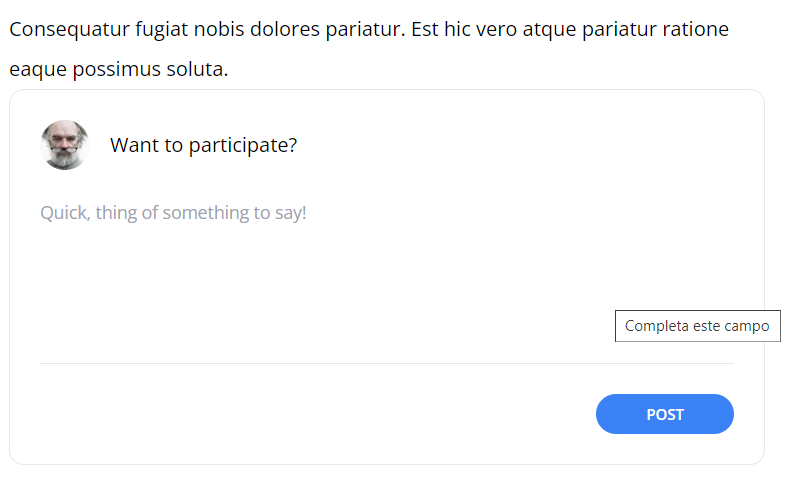

[< Go Back](../README.md)

# Creating a Comment Form

To make the users able to submit a comment, we need, a form of course.
This form will send the current user's ID and a space for the comment to be written.

```php
<form method="POST" action="/posts/{{ $post->slug }}/comments">
    @csrf

    <header class="flex items-center">
        id() }}"
            alt=""
            width="40"
            height="40"
            class="rounded-full">

        <h2 class="ml-4">Want to participate?</h2>
    </header>

    <div class="mt-6">
        <textarea
            name="body"
            class="w-full text-sm focus:outline-none focus:ring"
            rows="5"
            placeholder="Quick, thing of something to say!"
            required></textarea>
    </div>

    <div class="flex justify-end mt-6 pt-6 border-t border-gray-200">
        <button type="submit" class="bg-blue-500 text-white uppercase font-semibold text-xs py-2 px-10 rounded-2xl hover:bg-blue-600">Post</button>
    </div>
</form>
```

# Extract CSS

We can add a common css by just using a predefined div and using that when making coding new things that require said classes. To do this, we make a component 'panel' and add the following code:

```php
<div {{$attributes->merge (['class' => 'border border-gray-200 p-6 rounded-xl']) }}>
    {{ $slot }}
</div>
```

The actual class can be whatever you want. To use it, we just wrap whatever we want to that class to.

