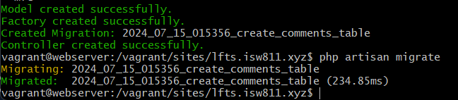

[< Go Back](../README.md)

# Make the Migration, Model and Controller

Using `php artisan make:model Comment -mfc`

with `m` creating a migrating, `f` a factory and `c` a controller.


In our migration file, we'll need a couple things in the comments, like the foreign id to attach it to posts, the foreign id to attach it to users and the body, of course.

```php
        Schema::create('comments', function (Blueprint $table) {
            $table->id();
            $table->foreignId('post_id')->constrained()->cascadeOnDelete();
            $table->foreignId('user_id')->constrained()->cascadeOnDelete();
            $table->text('body');
            $table->timestamps();
        });
```

To avoid constraint errors, we can use cascadeOnDelete to delete them when a post and user are deleted.

This should be added in the foreign key for 'users' in the 'posts' migration.

```php
$table->foreignId('user_id)->constrained()->cascadeOnDelete();
```

## Running the Migration

It's important to remember to migrate these changes with `php artisan migrate`


