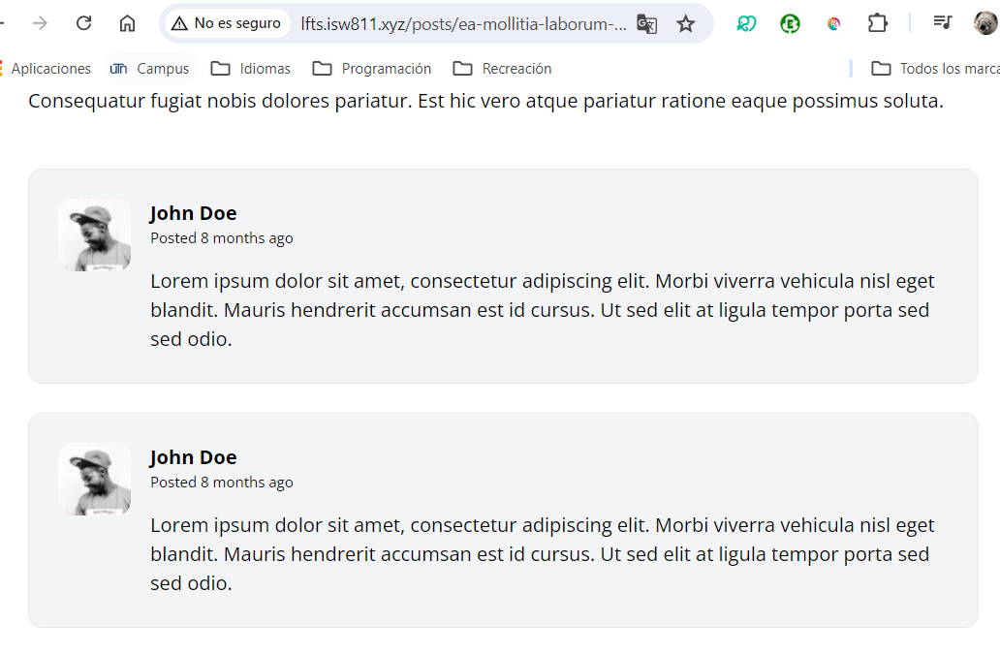

[< Go Back](../README.md)

# Make a Comment

To make a comment, we'll use an article tag and add a profile picture (the first div), a Title for the username and the comment in a p tag.

```php
<article class="flex bg-gray-100 border border-gray-200 p-6 rounded-xl space-x-4">
    <div class="flex-shrink-0">
        
    </div>

    <div>
        <header class="mb-4">
            <h3 class="font-bold">John Doe</h3>

            <p class="text-xs">
                Posted
                <time>8 months ago</time>
            </p>
        </header>

        <p>
            Lorem ipsum dolor sit amet, consectetur adipiscing elit. Morbi viverra vehicula nisl
            eget blandit. Mauris hendrerit accumsan est id cursus. Ut sed elit at ligula tempor
            porta sed sed odio.
        </p>
    </div>
</article>
```

This will be made it's own component as we've been doing. That whole section of code will go into a file post-comment.blade.php and inside of the show-blog we'll hardcode it to see it as `<x-post-comment>`


