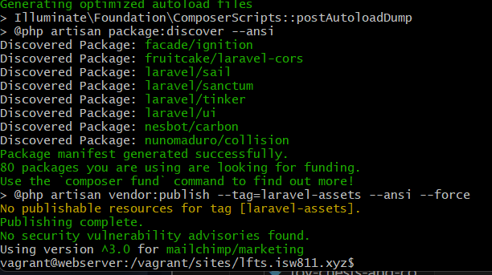
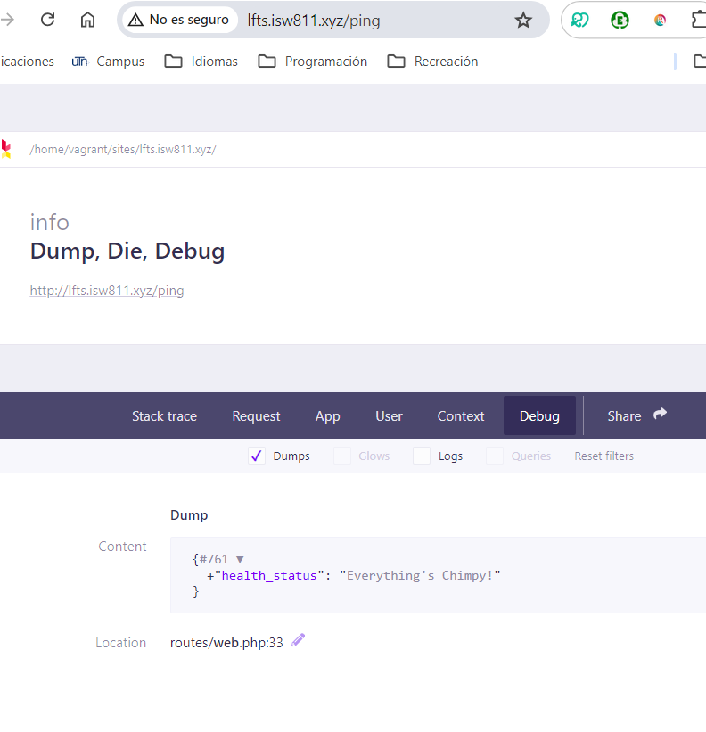
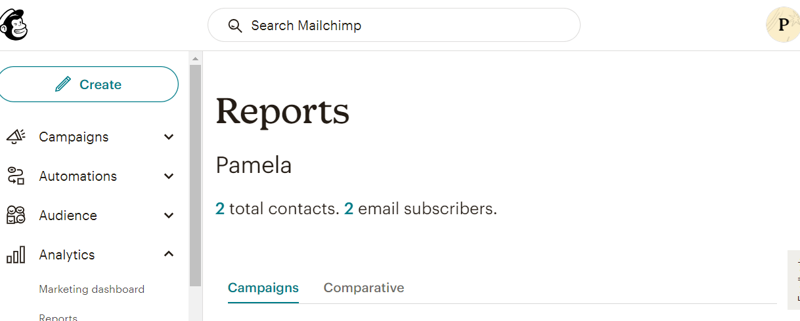

[< Go Back](../README.md)

# Mailchimp

## API KEY

To use Mailchimp, we will start by making an account and selecting whichever plan we like. Then, we can go into our account, on extras and generate the API key we'll paste in our .env file as`MAILCHIMP_KEY=xyz`. To read it, we can go to 'services' and write the following code:

```php
'mailchimp' => [
    'key' => env('MAILCHIMP_KEY')
]
```

## Installing

To install it, we simply paste into out terminal project ` composer require mailchimp/marketing` and wait for it to be done.



### Confirm it's Working

To do this, we can paste:

```php
Route::get('ping', function() {
    $mailchimp = new \MailchimpMarketing\ApiClient();
    $mailchimp->setConfig([
        'apiKey' => config('services.mailchimp.key'),
        'server' => 'us17'
    ]);

    $response = $mailchimp->ping->get();
    ddd($response);
});
```

into our routes file and see for ourselves that it is, in fact, working.



## Add to the list

To add a member to the list, we can start by watching the proceess hardcoding it in our route files.

```php
Route::get('ping', function() {
    $mailchimp = new \MailchimpMarketing\ApiClient();
    $mailchimp->setConfig([
        'apiKey' => config('services.mailchimp.key'),
        'server' => 'us17'
    ]);

    $response = $mailchimp->lists->addListMember('4fb37fc907', [
        'email_address' => 'pamurilloan@est.utn.ac.cr',
        'status' => 'subscribed'
    ]);

    ddd($response);
});
```

