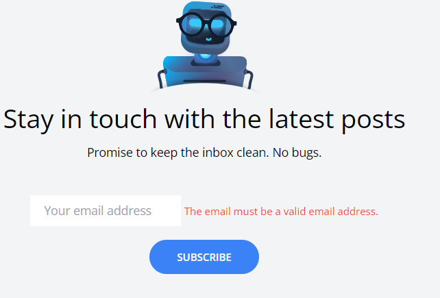

[< Go Back](../README.md)

# Submit the Newsletter

To make an usea finally subscribe to the Newsletter by clicking in the button, we must first make the process flexible:

```php
Route::post('newsletter', function() {
    request()->vavlidate(['email'=>'required|email']);
    $mailchimp = new \MailchimpMarketing\ApiClient();
    $mailchimp->setConfig([
        'apiKey' => config('services.mailchimp.key'),
        'server' => 'us17'
    ]);

    $response = $mailchimp->lists->addListMember('4fb37fc907', [
        'email_address' => request('email'),
        'status' => 'subscribed'
    ]);

    return redirect('/')->with('success','You are now signed up for our newsletter!');
});
```

We will eventually extract that code form there, but be patient.

Now, in the layout component, where we have our button, we change the action of the form and add a name to the input.

```php
<form method="POST" action="/newsletter" class="lg:flex text-sm">
@csrf
.
.
.
<input id="email"
name="email"
.
.
.>
```

Now, if we cant to show any error, we can throw an exception by encapsulating our code into a try catch and printing said exception with this code in routes:

```php
try {
    $response = $mailchimp->lists->addListMember('4fb37fc907', [
        'email_address' => request('email'),
        'status' => 'subscribed'
    ]);
} catch  (Exception $e) {
    throw \Illuminate\Validate\ValidationException::withMessage([
        'email' => 'This email could not be added to our newsletter list.'
    ]);
}
```

And this one in the layour, to print it:

```php
@error('body')
    <span class="text-xs text-red-500">{{ $message }}</span>
@enderror
```

Just below the input for the comment.



