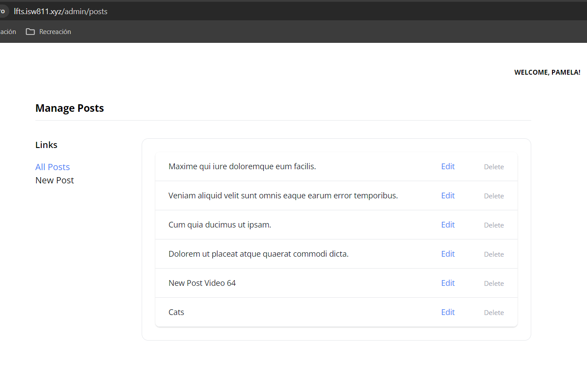

[< Go Back](../README.md)

# New Controller

We'll make a new admin controller `php artisan make:controller AdminPostController` to handle things specific to the administration side of posts.

We can call an index within our routes and print the posts.

```php
public function index()
{
    return view('admin.posts.index', [
        'posts' => Post::paginate(50)
    ]);
}
```

Plus, we should change the display on the settings to reflect this new code.

```php
<a href="/admin/posts" class="{{ request()->is('admin/posts') ? 'text-blue-500' : '' }}">All Posts</a>
```

# Using Tailwind

There are some pre made tables we can use made online with tailwind. In this case we can paste whichever one we want into the index and change it accordingly.

Among these changes there can be:

1. Changing the column titles
2. Adding pictures
3. Adding links
4. Changing colors

Depending on what you need.



# Edit

We want to edit a post, to do this, we must use the previous form with the changes necessary to get the information from the database and apply them into the inputs.

We also have to take into account somethings like the slug must not be validated as unique, because if we're editing something, it already exists. With that in mind, this is the function in the AdminPostController.

```php
public function update(Post $post)
    {
        $attributes = request()->validate([
            'title' => 'required',
            'thumbnail' => 'image',
            'slug' => ['required', Rule::unique('posts', 'slug')->ignore($post->id)],
            'excerpt' => 'required',
            'body' => 'required',
            'category_id' => ['required', Rule::exists('categories', 'id')]
        ]);

        if (isset($attributes['thumbnail'])) {
            $attributes['thumbnail'] = request()->file('thumbnail')->store('thumbnails');
        }

        $post->update($attributes);

        return back()->with('success', 'Post Updated!');
    }
```

And the editing page

```php
<x-layout>
    <x-setting :heading="'Edit Post: ' . $post->title">
        <form method="POST" action="/admin/posts/{{ $post->id }}" enctype="multipart/form-data">
            @csrf
            @method('PATCH')

            <x-form.input name="title" :value="old('title', $post->title)" required />
            <x-form.input name="slug" :value="old('slug', $post->slug)" required />

            <div class="flex mt-6">
                <div class="flex-1">
                    <x-form.input name="thumbnail" type="file" :value="old('thumbnail', $post->thumbnail)" />
                </div>

                thumbnail) }}" alt="" class="rounded-xl ml-6" width="100">
            </div>

            <x-form.textarea name="excerpt" required>{{ old('excerpt', $post->excerpt) }}</x-form.textarea>
            <x-form.textarea name="body" required>{{ old('body', $post->body) }}</x-form.textarea>

            <x-form.field>
                <x-form.label name="category"/>

                <select name="category_id" id="category_id" required>
                    @foreach (\App\Models\Category::all() as $category)
                        <option
                            value="{{ $category->id }}"
                            {{ old('category_id', $post->category_id) == $category->id ? 'selected' : '' }}
                        >{{ ucwords($category->name) }}</option>
                    @endforeach
                </select>

                <x-form.error name="category"/>
            </x-form.field>

            <x-form.button>Update</x-form.button>
        </form>
    </x-setting>
</x-layout>
```
## Minor Bugs

As we go changing the names of things it's normal for the page to not find certaing pages, fixing that is only a matter of going debugging and changing the names as needed.

# Delete a Post

Finally, a little button is seen in the index code to be able to delete posts. The function that does that is in AdminPostController, of course.

```php
 public function destroy(Post $post)
    {
        $post->delete();

        return back()->with('success', 'Post Deleted!');
    }
```

# Web Route Summary

```php
Route::post('admin/posts', [AdminPostController::class, 'store'])->middleware('admin');

Route::get('admin/posts/create', [AdminPostController::class, 'create'])->middleware('admin');

Route::get('admin/posts', [AdminPostController::class, 'index'])->middleware('admin');

Route::get('admin/posts/{post}/edit', [AdminPostController::class, 'edit'])->middleware('admin');

Route::patch('admin/posts/{post}', [AdminPostController::class, 'update'])->middleware('admin');

Route::delete('admin/posts/{post}', [AdminPostController::class, 'destroy'])->middleware('admin');
```