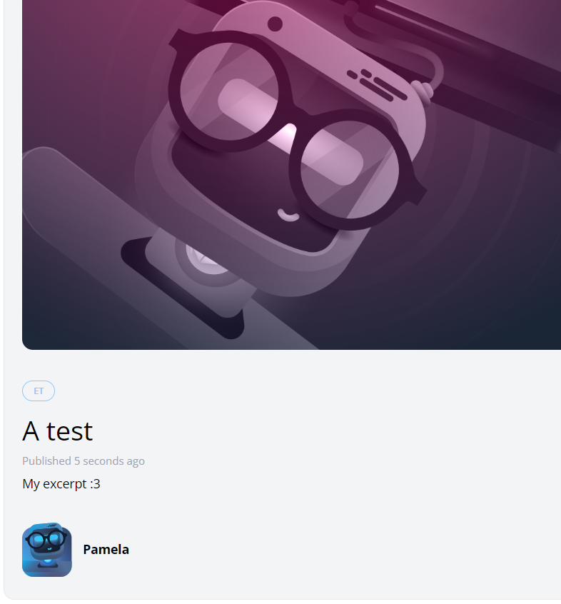

[< Go Back](../README.md)


# Create a Form

The process to create a new form is straightforward and we have done it before, so I will not go step by step here. It has the title, the excerpt, the body and a category.

The code looks like this:

```php
<section class="px-6 py-8">
        <section class="px-6 py-8">
        <x-panel class="max-w-sm mx-auto">
            <form method="POST" action="/admin/posts">
                @csrf

                <div class="mb-6">
                    <label class="block mb-2 uppercase font-bold text-xs text-gray-700"
                           for="title"
                    >
                        Title
                    </label>

                    <input class="border border-gray-400 p-2 w-full"
                           type="text"
                           name="title"
                           id="title"
                           value="{{ old('title') }}"
                           required
                    >

                    @error('title')
                        <p class="text-red-500 text-xs mt-2">{{ $message }}</p>
                    @enderror
                </div>

                <div class="mb-6">
                    <label class="block mb-2 uppercase font-bold text-xs text-gray-700"
                           for="slug"
                    >
                        Slug
                    </label>

                    <input class="border border-gray-400 p-2 w-full"
                           type="text"
                           name="slug"
                           id="slug"
                           value="{{ old('slug') }}"
                           required
                    >

                    @error('slug')
                        <p class="text-red-500 text-xs mt-2">{{ $message }}</p>
                    @enderror
                </div>


                <div class="mb-6">
                    <label class="block mb-2 uppercase font-bold text-xs text-gray-700"
                           for="excerpt"
                    >
                        Excerpt
                    </label>

                    <textarea class="border border-gray-400 p-2 w-full"
                           name="excerpt"
                           id="excerpt"
                           required
                    >{{ old('excerpt') }}</textarea>

                    @error('excerpt')
                        <p class="text-red-500 text-xs mt-2">{{ $message }}</p>
                    @enderror
                </div>

                <div class="mb-6">
                    <label class="block mb-2 uppercase font-bold text-xs text-gray-700"
                           for="body"
                    >
                        Body
                    </label>

                    <textarea class="border border-gray-400 p-2 w-full"
                           name="body"
                           id="body"
                           required
                    >{{ old('body') }}</textarea>

                    @error('body')
                        <p class="text-red-500 text-xs mt-2">{{ $message }}</p>
                    @enderror
                </div>

                <div class="mb-6">
                    <label class="block mb-2 uppercase font-bold text-xs text-gray-700"
                           for="category_id"
                    >
                        Category
                    </label>

                    <select name="category_id" id="category_id">
                        @foreach (\App\Models\Category::all() as $category)
                            <option
                                value="{{ $category->id }}"
                                {{ old('category_id') == $category->id ? 'selected' : '' }}
                            >{{ ucwords($category->name) }}</option>
                        @endforeach
                    </select>

                    @error('category')
                        <p class="text-red-500 text-xs mt-2">{{ $message }}</p>
                    @enderror
                </div>

                <x-submit-button>Publish</x-submit-button>
            </form>
        </x-panel>
    </section>
</x-layout>
```

Make sure to add a 'store' method and the corresponding end-point both in the routes...

`Route::post('admin/posts', [PostController::class, 'store'])->middleware('admin');`

and inside the PostController:

```php
public function store()
{
    $attributes = request()->validate([
        'title' => 'required',
        'slug' => ['required', Rule::unique('posts', 'slug')],
        'excerpt' => 'required',
        'body' => 'required',
        'category_id' => ['required', Rule::exists('categories', 'id')]
    ]);

    $attributes['user_id'] = auth()->id();

    Post::create($attributes);

    return redirect('/');
}
```

### Forbidden message for non logged in users


### Form for admin


### Post created


