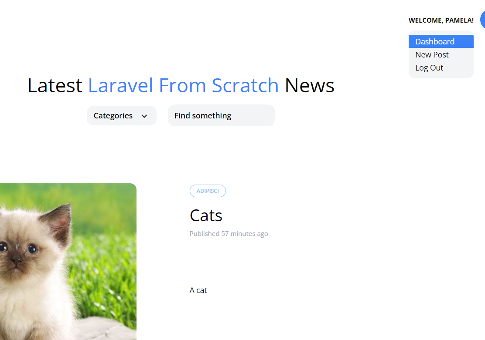
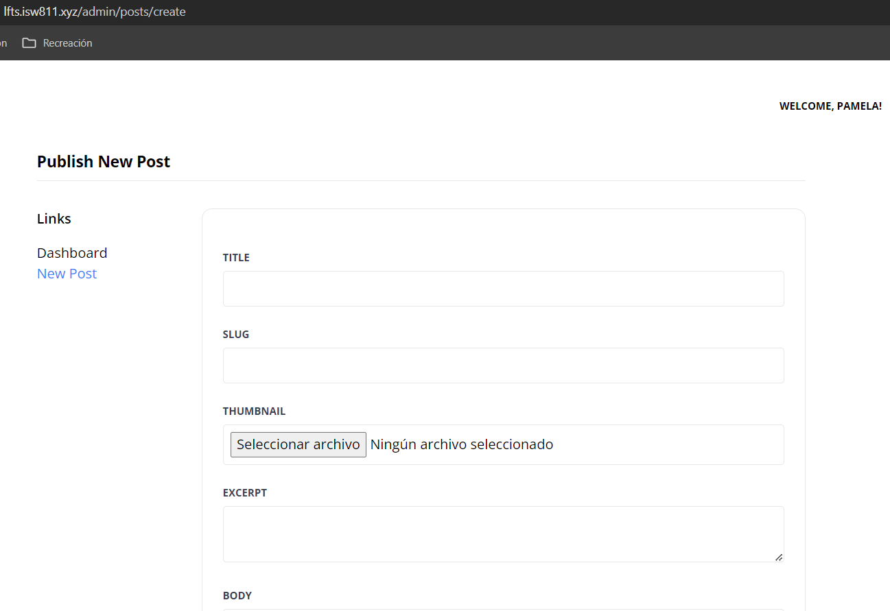

[< Go Back](../README.md)

# Adding a Dropdown

There's no really a good way to change between pages at the moment, to fix this, we're gonna add a dropdown below the welcome message in our layout file to show these different options.

```php
@auth
    <x-dropdown>
        <x-slot name="trigger">
            <button class="text-xs font-bold uppercase">Welcome, {{ auth()->user()->name }}!</button>
        </x-slot>

        <x-dropdown-item href="/admin/dashboard">Dashboard</x-dropdown-item>
        <x-dropdown-item href="/admin/posts/create" :active="request()->is('admin/posts/create')">New Post</x-dropdown-item>
        <x-dropdown-item href="#" x-data="{}" @click.prevent="document.querySelector('#logout-form').submit()">Log Out</x-dropdown-item>

        <form id="logout-form" method="POST" action="/logout" class="hidden">
            @csrf
        </form>
    </x-dropdown>
@else
    <a href="/register" class="text-xs font-bold uppercase {{ request()->is('register') ? 'text-blue-500' : '' }}">Register</a>
    <a href="/login" class="ml-6 text-xs font-bold uppercase {{ request()->is('login') ? 'text-blue-500' : '' }}">Log In</a>
@endauth
```
And we can add a bit more style to the dropdown itself
```php
<div x-data="{ show: false }" @click.away="show = false" class="relative">
```

You can also see a bit of logic up there to make the POST submission, among other things.



## Settings

The admin pages look a bit empty, we can add a sidebar, among other things, using components! In this case, we'll make a settings component for a dashboard.

```php
@props(['heading'])

<section class="py-8 max-w-4xl mx-auto">
    <h1 class="text-lg font-bold mb-8 pb-2 border-b">
        {{ $heading }}
    </h1>

    <div class="flex">
        <aside class="w-48">
            <h4 class="font-semibold mb-4">Links</h4>

            <ul>
                <li>
                    <a href="/admin/dashboard" class="{{ request()->is('admin/dashboard') ? 'text-blue-500' : '' }}">Dashboard</a>
                </li>

                <li>
                    <a href="/admin/posts/create" class="{{ request()->is('admin/posts/create') ? 'text-blue-500' : '' }}">New Post</a>
                </li>
            </ul>
        </aside>

        <main class="flex-1">
            <x-panel>
                {{ $slot }}
            </x-panel>
        </main>
    </div>
</section>
```



Additionally, there's a few changes in the input and textarea files.

## Input
```php
@props(['name'])

<x-form.field>
    <x-form.label name="{{ $name }}"/>

    <input class="border border-gray-200 p-2 w-full rounded"
           name="{{ $name }}"
           id="{{ $name }}"
           value="{{ old($name) }}"
           required
           {{ $attributes }}
    >

    <x-form.error name="{{ $name }}"/>
</x-form.field>
```

## Textarea
```php
@props(['name'])

<x-form.field>
    <x-form.label name="{{ $name }}" />

    <textarea
        class="border border-gray-200 p-2 w-full rounded"
        name="{{ $name }}"
        id="{{ $name }}"
        required
        {{ $attributes }}
    >{{ old($name) }}</textarea>

    <x-form.error name="{{ $name }}" />
</x-form.field>
```


