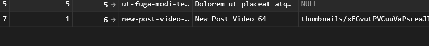
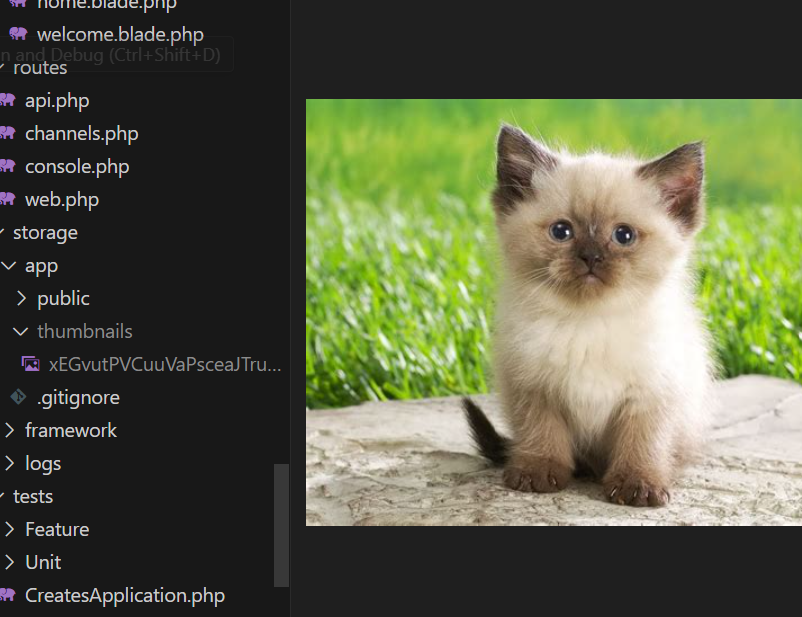
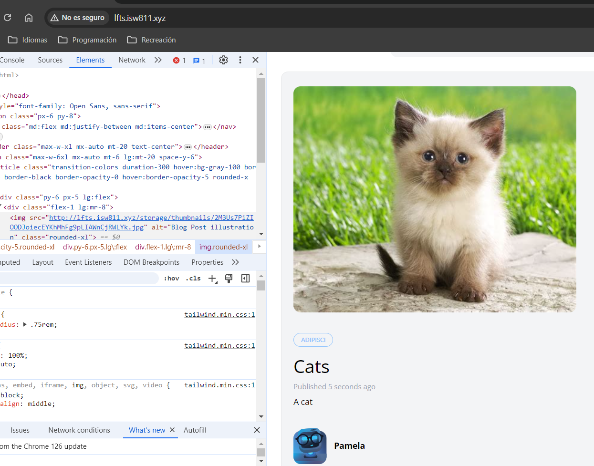

[< Go Back](../README.md)

# Create Heading

Before we get to the thick of it, we should add a header to make it prettier and more readable.

```php
<section class="py-8 max-w-md mx-auto">
        <h1 class="text-lg font-bold mb-4">
            Publish New Post
        </h1>

        <x-panel>
```

# Upload an Image

To allow an admin to upload an image we must have the corresponding input in the form, like so:

```php
 <div class="mb-6">
    <label class="block mb-2 uppercase font-bold text-xs text-gray-700"
            for="thumbnail"
    >
        Thumbnail
    </label>

    <input class="border border-gray-400 p-2 w-full"
            type="file"
            name="thumbnail"
            id="thumbnail"
            required
    >

    @error('thumbnail')
        <p class="text-red-500 text-xs mt-2">{{ $message }}</p>
    @enderror
</div>
```

And then of course, change the function that's called when the admin submits the form.

```php
'thumbnail' => 'required|image',
.
.
.
$attributes['thumbnail'] = request()->file('thumbnail')->store('thumbnails');
```

This previous code will go into the PostController, this way the files the admin uploads will pass first through the file system and save them on public. To make this work though, first one must change 'local' to 'public' in line 16 of filesystems.

`'default' => env('FILESYSTEM_DRIVER', 'public'),`

This thumbnail will have to go into the database. so we can code it into our migration of posts `$table->string('thumbnail')->nullable();`

Now, when we upload an image, it is not in the file we want. To fix this, we create a link `php artisan storage:link`





Finally, we change the random images we had into our thumbnails:

`thumbnail) }}" alt="Blog Post illustration" class="rounded-xl">`



___
PD: I had to run `php artisan config:clear` in the terminal and restart everything for the changes in filesystems to apply.


