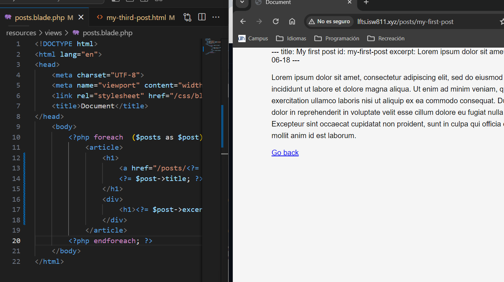
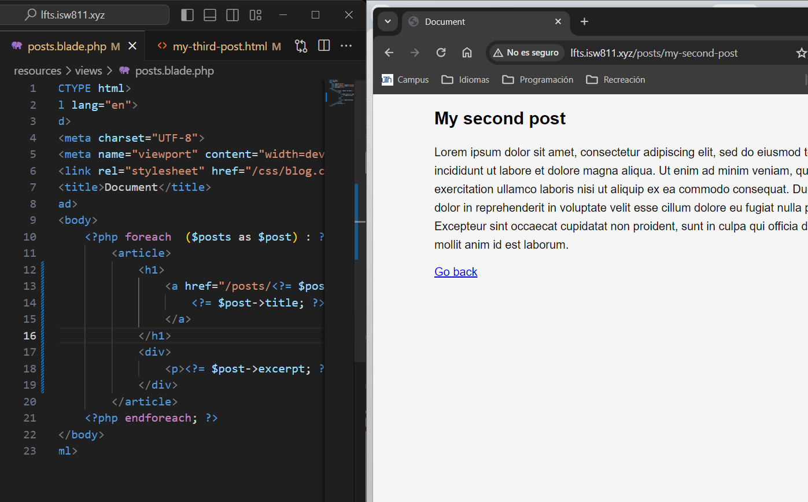

[< Go Back](../README.md)

# Metadata

We can introduce metadata into our posts by using

```php
---
id: this is an id
name: this is a name
---
```

# Changes in model

These changes must be implemented in the model in order to be able to create an object Post:

```php
public $title;
public $excerpt;
public $date;
public $body;
public $id;

public function __construct($title, $excerpt, $date, $body, $id)
{
    $this->title = $title;
    $this->excerpt = $excerpt;
    $this->date = $date;
    $this->body = $body;
    $this->id = $id;
}
```


# Accesing the data

On the top of our post files. We can access this data using Yaml and create a new post with it.

```php
$files = File::files(resource_path("posts"));
$posts = [];

foreach ($files as $file) {
    $document = YamlFrontMatter::parseFile($file);
    $posts[] = new Post(
        $document->title,
        $document->excerpt,
        $document->date,
        $document->body(),
        $document->id
    );
}
```

It is necessary to include an id or an oherwise useful identifier to properly locate them and show them.

# Changes in HTML

Now that we can access this metadata via the route in out html, it's time to make some changes:

```php
<body>
    <?php foreach  ($posts as $post) : ?>
        <article>
            <h1>
                <a href="/posts/<?= $post->id;?>">
                <?= $post->title; ?>
            </h1>
            <div>
                <h1><?= $post->excerpt; ?></h1>
            </div>
        </article>
    <?php endforeach; ?>
</body>
```

The metadata allows us to organize our html however we want.



For the metadata not to show, we must change the post, of course, like so:

```php
<body>
    <article>
        <h1><?= $post->title; ?></h1>
        <div>
            <?= $post->body; ?>
        </div>
    </article>

    <a href="/">Go back</a>
</body>
```


