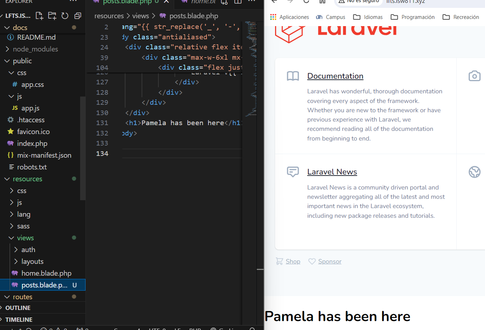
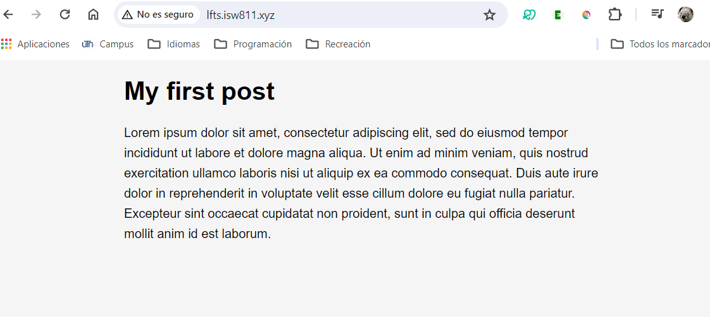

[< Go Back](../README.md)

# Changing the view's html



# First post

Our first task is to change the routing, either renaming the existing one or adding to it.

Then, by changing the css and the html of the 'posts.blade.php' code, we can get something like this:



# Links

To add a link to an h1, for example, we use an ` <a href="exampleA">`

And then in the folder routes, in the file web.php, we have something like this 
```php
    Route::get('exampleA', function () {
        return view('exampleA-Page');
    });
```
Of course, for this to work, we should have a 'exampleA-page.blade.php' in views

# Go back

We can use any of the routes in any of the views, so, to go back home, a simple `<a href="/">Go back</a>` should be enough
