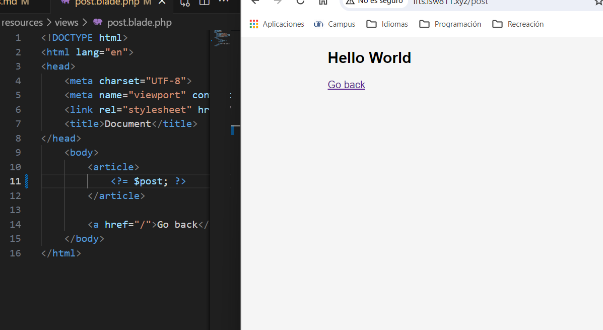
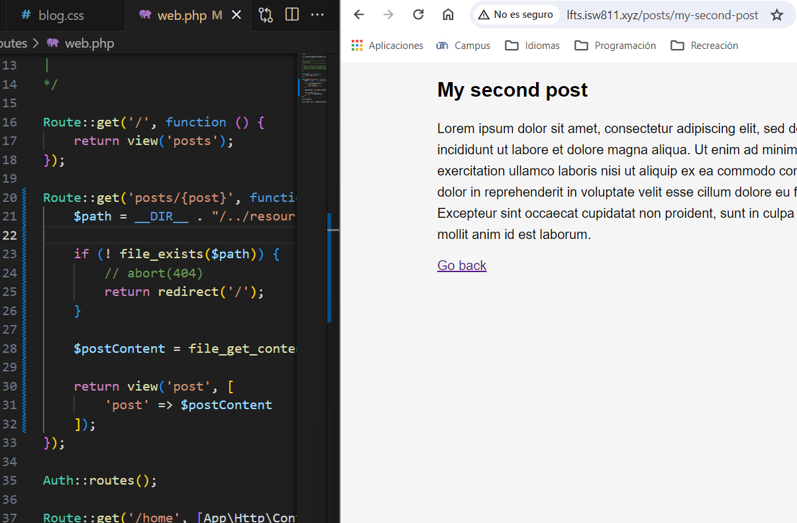

[< Go Back](../README.md)

# Variables

To pass a variable from the route to the view, we can use a set of `[]`, like this:

```php
Route::get('post', function () {
    return view('post', [
        'post' => '<h1>Hello World</h>'
    ]);
});
```

In routes, and then:

```php
    <?= $post; ?>
```

In the section of the page we want to receive it.



Now, as this is hard-coded, we must make it more malleable.
To do this, we get the post file name in the url so we can access it as a variable in the function inside routes.
Then, we complete the path with the information given and corroborate it exists before adding it to the `return` part of the route.

```php
Route::get('posts/{post}', function ($post) {
    $path = __DIR__ . "/../resources/posts/{$post}.html";

    if (! file_exists($path)) {
        // abort(404)
        return redirect('/');
    }

    $postContent = file_get_contents($path);

    return view('post', [
        'post' => $postContent
    ]);
});
```



