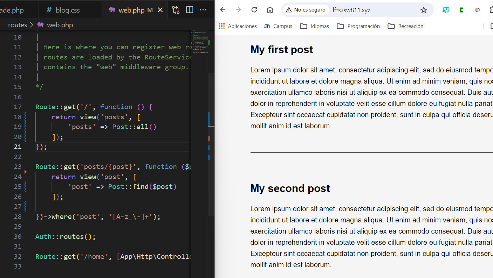

[< Go Back](../README.md)

# Creating a Model
In OOP, a post is, at the end of the day, an object. Every object that we can make a crud out of should have its own model, with their corresponding 'find', 'create', 'delete' and such methods.

So, we make a Post.php inside the Models in our project and a find method using the code we had in routes:

```php
class Post
{
    public static function find($post) {
        $path = resource_path("posts/{$post}.html");

        if (! file_exists($path)) {
            throw new ModelNotFoundException();
        }

        return cache()->remember("posts.{post}", now()->addMinutes(20), fn () => file_get_contents($path));

    }
}
```
# Accesing the Model

To clean up the route file, we can use the model 'Post' and its method find, like this:

```php
Route::get('posts/{post}', function ($post) {
    return view('post', [
        'post' => Post::find($post);
    ]);

})->where('post', '[A-z_\-]+');
```

# Iterating the Model

We can do the same trick as with the find function, by creating a new one in the model Post called 'all' and asking for them in the route:

```php
Route::get('/', function () {
    return view('posts', [
        'posts' => Post::all()
    ]);
});
```

And in the Post:
```php
public static function all() {
    $files = File::files(resource_path("posts/"));
    return array_map(function ($file) {
        return $files->getContents();
    }, $files);
}
```

