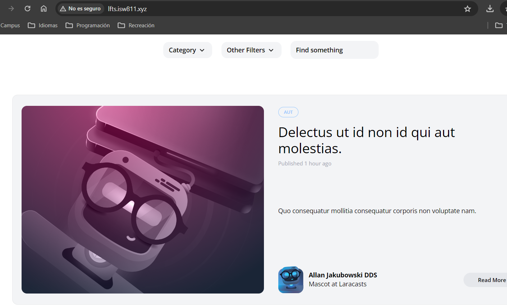

[< Go Back](../README.md)

# Post Time

Now it's time to copy and paste the post page they have given us and give it a few of the same changes we've been doing. This includes changing the title, the excerpt, the body, date published and a lot more.

Notable changes include the modulation of a category button and the modulation of the grid pattern logic for the posts.

