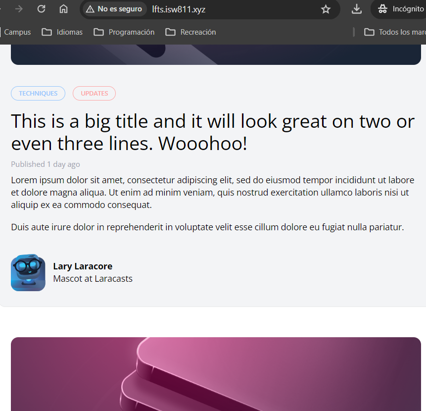

[< Go Back](../README.md)

# Importing Images and HTML

The first part is very simple, it's just copying the images into the public folder, the header and footer into the layout and the rest goes in the posts view.

To do further cleanup, the articles will go into post-card and will be included in posts.blade.php using `<x-layout>`, same with the header, though it is important to notice the convention of putting and underscore before the name.
