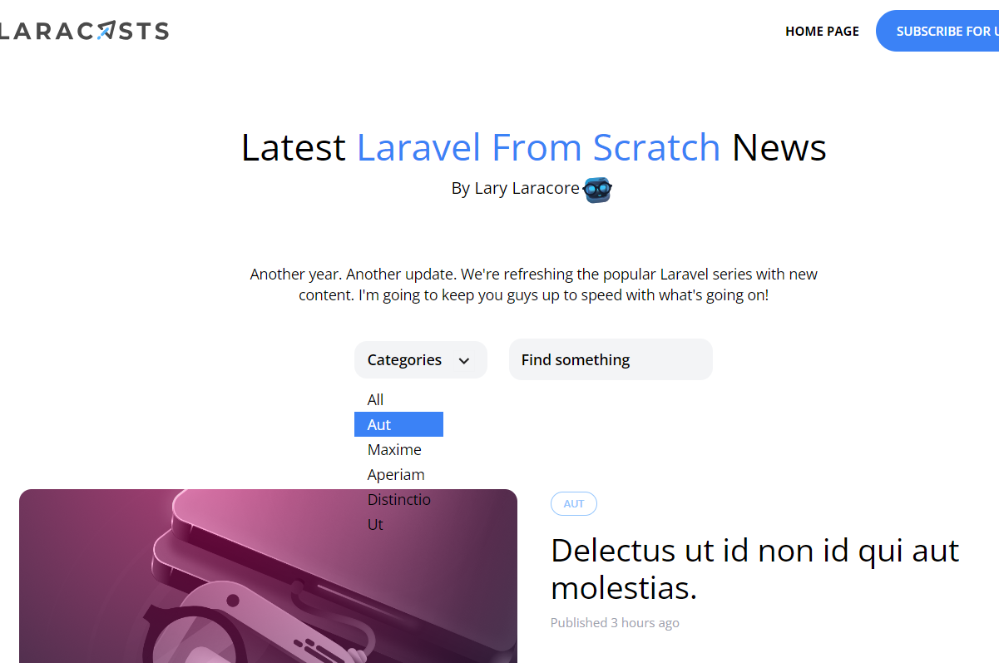

[< Go Back](../README.md)

# Extract a component

Having completed our category selector, we can separate the dropdown into another component, with a space for the trigger that will make it drop-down and the slot, which is the space for the links.

```php
@props(['trigger'])

<div x-data="{show: false}" @click.away="show = false">
<div @click="show = ! show">
    {{ $trigger}}
</div>


    <div x-show="show" class="py-2 absolute bg-grey-100 rounded-xl z-50" style="display:none">
        {{ $slot }}
    </div>
</div>
```

# DRY

There is a lot of css going on, so it's best to separate the dropdown item into another component. And furthermore, separate the classes into a variable:

```php
@props(['active' => false])

@php
    $classes = 'block text-left px-3 text-sm leading-6 hover:bg-blue-500 focus:bg-blue-500 hover:text-white focus:text-white';

    if ($active) $classes .= 'bg-blue-500 text-white';
@endphp

<a {{$attributes->merge (['class' => $classes]) }}>
    {{$slot}}
</a>
```

# Final component in Header

```php
    <x-dropdown>

        <x-slot name="trigger">
            <button class="lg:inline-flex py-2 pl-3 pr-9 text-left text-sm font-semibold w-32">

                {{ isset($currentCategory) ? ucwords($currentCategory->name) : 'Categories' }}

                <x-down-arrow class="absolute pointer-events-none" />
            </button>

        </x-slot>
        <x-dropdown-item href="/">All</x-drop-down-item>

        @foreach ($categories as $category)
        {{ isset($currentCategory) && $currentCategory->is($category) ? 'bg-blue- text-white' : '' }}
            <x-dropdown-item 
                href="/categories/{{ $category->slug }}"
                :active="isset($currentCategory) && $currentCategory->is($category)">
                    {{ ucwords($category->name)}} 
            </x-drop-down-item>
        @endforeach
</x-dropdown>
```



# Name route

It is quite literally a name you asign to a route. It's as easy as adding at the end of the route `->name('aName')`

This works for when you're asking for the existence of a route.

