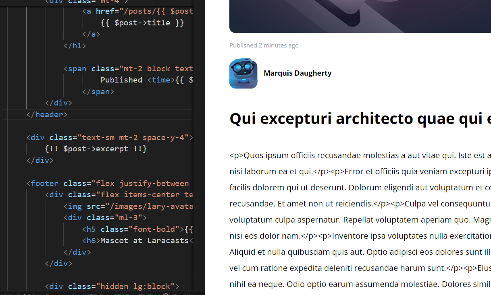

[< Go Back](../README.md)

# Slight corrections

1. To better personalize our page, we will delete a littlle of the general text that we didnt make through the files.

2. Then, we're gonna elongate our paragraphs of both the excerpt and the body.

```php
'excerpt' => '<p>' . implode('</p><p>', $this->faker->paragraphs(2)) . '</p>',
'body' => '<p>' . implode('</p><p>', $this->faker->paragraphs(6)) . '</p>' 
```
3. We have to deny the escape of string in the places where they're called for the p tags to dissapear.



In my case it didn't work even though I was doing it correctly in theory, I'll have to further investigate the problem.
