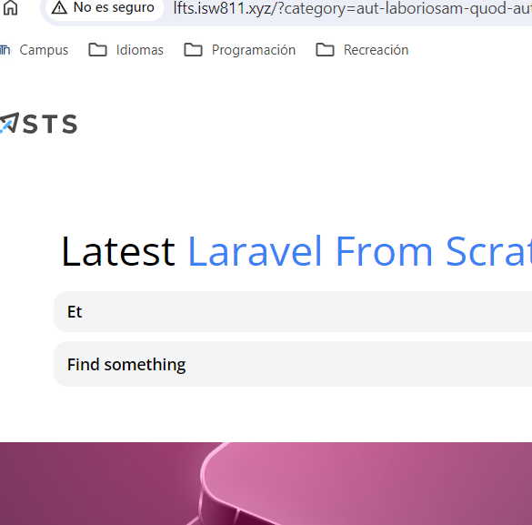

[< Go Back](../README.md)

# Advanced filters

## First Way

For now, we are have only one conditional to check for anything in the search bar. We can add 'category' to be able to get the category from the query string. 

```php
public function index()
{
    $posts = Post::latest();

    return view('posts', [
        'posts' => Post::latest()->filter(request(['search', 'category']))->get(),
        'categories' => Category::all()
    ]);
}
```

Further down, in the Post model, we can add an additional query to get the post by the category's slug.

```php
    $query->when($filters['category'] ?? false, fn($query, $category) =>
        $query
            ->whereExists(fn($query) =>
                $query->from('categories')
                ->whereColumn('categories.id','posts.category_id')
                ->where('categories.slug', $category))
        );
```
## Second Way

Comment our
``Route::get('categories/{category:slug}', function (Category $category ) {``
To be able to add category to the query string.

```php
<x-dropdown-item 
    href="/?categories={{ $category->slug }}"
    :active='request()->is("categories/{$category->slug}")'
    >{{ ucwords($category->name)}} 
</x-dropdown-item>
```

In our PostController,we search for the category's slug.

```php
public function index()
{
    $posts = Post::latest();

    return view('posts', [
        'posts' => Post::latest()->filter(request(['search', 'category']))->get(),
        'categories' => Category::all(),
        'currentCategory' => Category::firstWhere('slug', request('category'))
    ]);
}
```

And of course, change the href of our dropdown item to reflect all the other code changed.

```php
<x-dropdown-item 
    href="/?category={{ $category->slug }}"
    :active='request()->is("categories/{$category->slug}")'
    >{{ ucwords($category->name)}} 
</x-dropdown-item>
```



