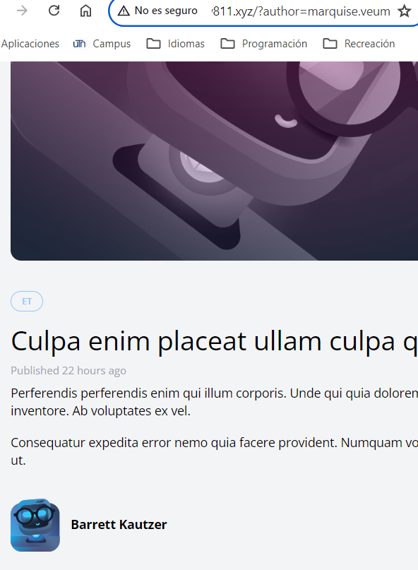

[< Go Back](../README.md)

# Filter by the Author

We already have the route, so it's only a matter of changing a couple things.

1. In both post cards, we should add an `a` tag to be our link>

```php
<h5 class="font-bold">
    <a href="/authors/{{ $post->author->username }}">
        {{ $post->author->name }}
    </a>
</h5>
```

2. And to update the route to the current organization, we change 'posts' into 'posts.index'
```php
Route::get('authors/{author:username}', function (User $author ) {
    return view('posts.index', [
        'posts' => $author->posts
    ]);
});
```

# Make Authors a part of the Posts Filter

Simple as we've done previously, we make a query for that in the Post model.

```php
$query->when($filters['author'] ?? false, fn($query, $author) =>
            $query->whereHas('author', fn($query) =>
                $query->where('username', $author)
            )
        );
```

This will look for the author filter, if it detects one, it will look for the posts that have a matching username with the one requested.

It is neccessary for the PostController to accept the author filter and to change the url in the links we have.

```php
public function index()
{
    $posts = Post::latest();

    return view('posts.index', [
        'posts' => Post::latest()->filter(request(['search', 'category', 'author']))->get()
    ]);
}
```

```php
<h5 class="font-bold">
    <a href="/?author={{ $post->author->username }}">
        {{ $post->author->name }}
    </a>
</h5>
```

