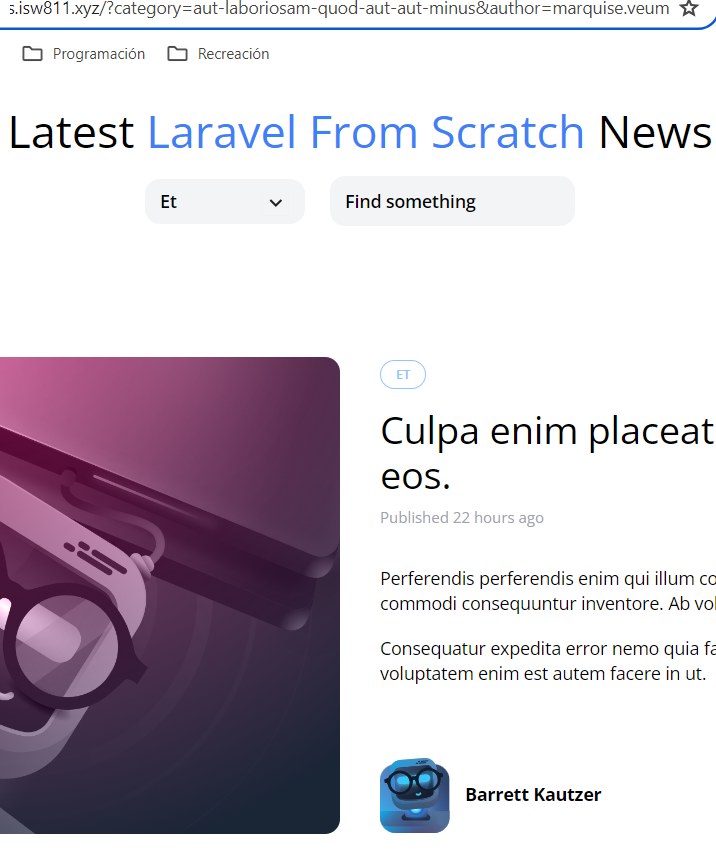

[< Go Back](../README.md)

# Combining both filters

## Cheating the category erasure

Because the GET deletes all query string in favor of the thing submited, we can have a hidden input with the category we have (if we have one) to submit with the searchbar.

```php
@if (request('category'))
    <input type="hidden" name="category" value="{{ request('category') }}">
@endif
```

## Cheating the searchbar erasure

To integrate the search filter into an already existing category, we have to analyze the url, leave out 'category' to avoid duplication, and then append that to the new query string. All of this, in our category-dropdown component.

```php
href="/?category={{ $category->slug }}&{{ http_build_query(request()->except('category')) }}"
```

