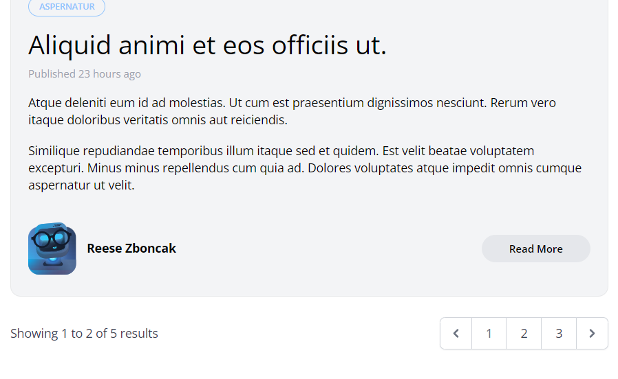

[< Go Back](../README.md)

# Standard pagination

Eloquent has a very easy way to paginate any json, and that is by using 'paginate()'. We simply replace the get method in our PostController with the paginate and there we have it.

## Linking to other pages

While using the paginate method, we can add 'links()' like so:

```php
<x-layout>
@include ('posts._header')
    <main class="max-w-6xl mx-auto mt-6 lg:mt-20 space-y-6">
    @if ($posts->count())
        <x-posts-grid :posts="$posts"/>
        {{ $posts->links() }}
    @else
        <p class="text-center">No posts yet, we're very sorry</p>
    @endif
    </main>
</x-layout>
```



## Exclude pagination while filtering

People don't usually want to include only the categories of only one page, that makes no sense. So, we can avoid this error by excluding the page from the query string like we did with the category when combining the filters:

```php
href="/?category={{ $category->slug }}&{{ http_build_query(request()->except('category', 'page')) }}"
```

Additionally, we should change the href for the home page for it to avoid categories and pages too.

```php
    <x-dropdown-item href="/?{{ http_build_query(request()->except('category', 'page')) }}" 
        :active="request()->routeIs('home')">
            All
    </x-dropdown-item>
```

## Personalize style

We don't really own the styling of the pagination, so we cannot change it. But, if we ask for access to those files, we can have them in our project via the following command.

```bash
php artisan vendor:publish
>16
```

In my case, the laravel pagination is at 16, but it can change with the version.

To tweak them, we can go to our AppServiceProvider in the App\Providers folder and use `Paginator::useBootstrap()` or tailwind, or whichever one we need.

## Avoid Reseting filters

If we want to include our current query string in our pagination, one can simply add `->withQueryString()` to our previous pagination. Like this:

```php
return view('posts.index', [
    'posts' => Post::latest()->filter(
        request(['search', 'category', 'author'])
    )->paginate(2)->withQueryString()
]);
```