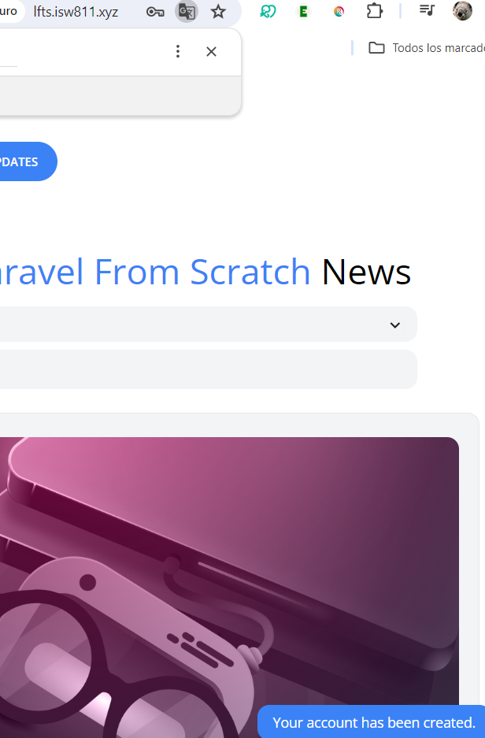

[< Go Back](../README.md)

# Flash messages

A slash message is a message that appears only to be seen once by the user.

```php
session()->flash('success', 'Your account has been created.');
```

This message can be displayed wherever you want on the page by checking if session has been successful. This one in specific has a little JS in it to make it dissapear after five seconds.

```php
@if (session()->has('success'))
    <div x-data="{ show: true }"
         x-init="setTimeout(() => show = false, 4000)"
         x-show="show"
         class="fixed bg-blue-500 text-white py-2 px-4 rounded-xl bottom-3 right-3 text-sm"
    >
        <p>{{ session('success') }}</p>
    </div>
@endif
```

In our case, we made it into a component, so it's cleaner to access everything.



# Saving lines

A quick way to send a message, is to attach it to the redirect, like this:

```php
return redirect('/')->with('success', 'Your account has been created.');;
```