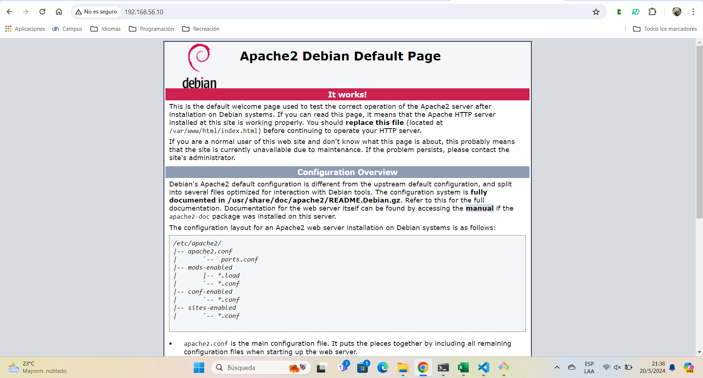

# Workshop 01

## Creating working directory

First of all, we must create a new working directory by executing the following commands in the desired folder, using always git bash.

```bash
cd ~
mkdir ISW811
cd ISW811
mkdir Workshop01
cd Workshop01
```

A readme is necessary, to create it, one can do it manually or through commands, like this:

```bash
touch Readme.md
code .
```

## Working with Vagrant

To create a VagrantFile for debian Bookworm, we use the following command

```bash
vagrant init debian/bookworm64
```

This will be done after creating a folder in "Workshops" named VMs, and then another one inside "webserver"

To continue, one shall enter VagrantFile and de-comment line 35 to see the private network.
As 33 is not used in virtualbox, we´re gonna change it to 56 and the 10 will be anything the same or greater than it.

The changes look like this:

```bash
#config.vm.network "private_network", ip: "192.168.33.10"
```

```bash
config.vm.network "private_network", ip: "192.168.56.10"
```

If there is not such network, it must be created in the virtualbox tool compartment

Now, and only now, we can get the vagrant up, just like this:

```bash
vagrant up
vagrant status
```

## Installing dependencies

To download the available list of packages, and then install the ones we require, we use the following commands

```bash
sudo apt-get update
sudo apt-get install -y apache
sudo apt-get install -y curl
```

## IP addresses

The following commands are to confirm the connection between the host and the virtual machine

First, in the virtual machine

```bash
ip ad
```
And then, in the host:

```bash
ping 196.168.65.10
```

Finally, that same ip should be running in the browser, like this:




To shut the virtual machine down, finally:

```bash
exit
vagrant halt
```

___

Created by Pamela Murillo
