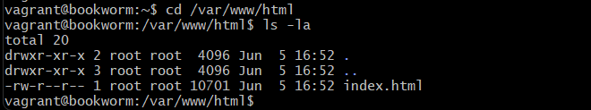
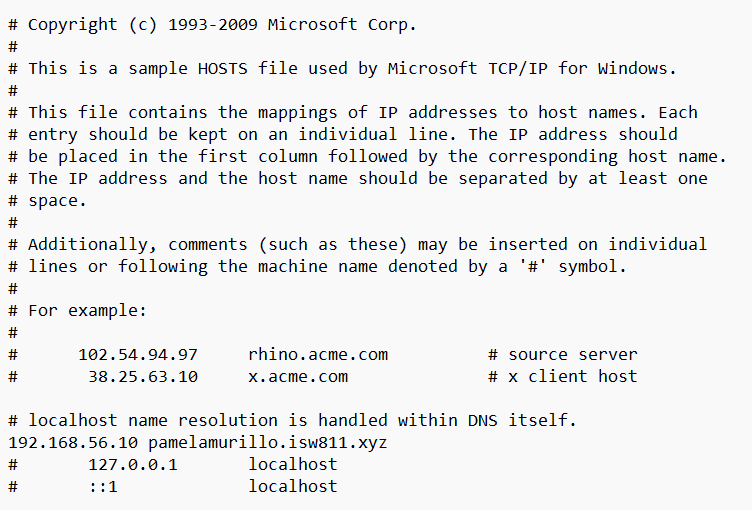
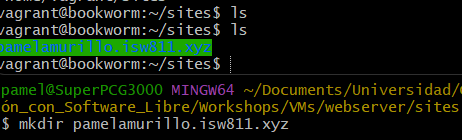
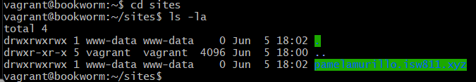
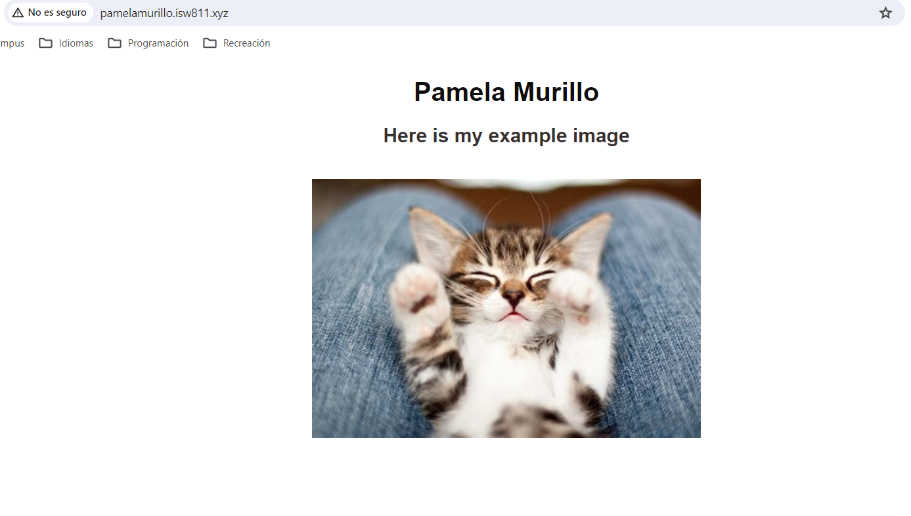

# Workshop 02 - LAMP

## Preambule

We make sure to have the server running with:

```bash
vagrant up
```


Inside webserver, in another terminal, we create a folder called "sites" to manage our websites.

Apart from this, we have to take into account our ssh key, this is individual for each computer and each user, and the commands to generate it and copy it vary across OS. Anywho, it looks something like this:

ssh-rsa AAAAB3NzaC1yc2EAAAADAQABAAABgQDRaG8RZXe0WG36O+Jm6P5m4H5AzBsDja2FR7ixsnHfJnTm1n928+5nKydqO7Rz20hhULPb4dRolZ6XtqWlfz0C/VHUPlVPEXOEmsu+M9nh+/COfobP3gFj+NBP7WcnWaEbKRbBxlpgW/td6sLOPWtFpkVFk5H42goPxiniSoHCQelQFyalFLZxM7NZ2sZjTtzruH5Usn/+uSTQMwScdoTDNENtsFtJIKaBoQZKSiVBpoURfYdIW0EUamvsAPZzjWENcmYQ4ymkgPNw1Z7eHxnjN5Lj0EZPpJ9+z3mwzLwtVCkWmFk1YJWyzVRvoyWm/NkpUkhtxhs5YE9pi/A+wSyqT+UEregXeXDvdhGSW5bJblh2Th8BExia5nZlxhgXcdN8sOHJKLEEggkbTz5zKD7BKB/SQC6C1C0LHLEyoKjvvSFMsp1O94NrOgf6E2Wtx90atOaVerVeeJpb/ZJ2g2Dmi7gNWQ/N2AUAyZKDHevoxWzznVsqIT84PRjjLyDLEgk= pamel@SuperPCG3000

the end, being the username.

This key will have to be copied and pasted inside the .ssh/ folder of our virtual host, being careful to not erase the already existing one there. This can be done using vim or nano.

```bash
vagrant@bookworm:~/.ssh$ nano authorized_keys
```

With this key, one can enter vagrant from anywhere using:

```bash
ssh vagrant@192.168.56.10
```

Having done this, one can modify the html of the page in the address 192.168.56.10.

```bash
cd /var/www/html
ls -la
sudo nano index.html
```
With the second command we can see it, and with the third we can edit it.



## Simulating a domain

To sustain a webpage, one need a domain, for that, we must enter the file __hosts__ as an administrator. Located in windows, in ´C:\Windows\System32\drivers\etc\hosts´ and add an IP and a hostname, as seen by the uncommented line.



On our webserver folder, we´ll make another named confs, inside of it, we make a configuration file. The name is, ideally, the name of the domain with the addition of .conf

```bash
mkdir confs
cd confs
touch pamelamurillo.isw811.xyz.conf
```

Now, in the host machine we´ll open Vagrant file and in file 46 we´ll add

`config.vm.synced_folder "./sites", "/home/vagrant/sites", owner: "www-data", group: "www-data"`

Having done this, we can save and halt the machine with `vagrant halt`, we up it again and now all the changes should be seen both ways.




## Habilitating the domain
Now, after changing our page to our convinience, we must allow for it to show insted of the default.
To do this, we locate ourselves in our host machine and copy the files:

```bash
vagrant@bookworm:/vagrant$ cd confs/
vagrant@bookworm:/vagrant/confs$ ls -la
total 8
drwxrwxrwx 1 vagrant vagrant    0 Jun  5 17:45 .
drwxrwxrwx 1 vagrant vagrant 4096 Jun  5 17:41 ..
-rwxrwxrwx 1 vagrant vagrant  569 Jun  5 17:48 pamelamurillo.isw811.xyz.conf
vagrant@bookworm:/vagrant/confs$ sudo cp pamelamurillo.isw811.xyz.conf /etc/apache2/sites-available/
```


Now the final configuration is near, we must include the server with their server name, the virtual host, enable the site, and restart it.

```bash
sudo a2enmod vhost_alias
sudo apache2ctl -t
echo "ServerName webserver" | sudo tee -a /etc/apache2/apache2.conf
sudo apache2ctl -t
sudo a2ensite pamelamurillo.isw811.xyz.conf
```

In the moment we obtain the Syntax OK, we can restart and enjoy our page.
``` bash
sudo systemctl reload apache2
```



___

Created by Pamela Murillo