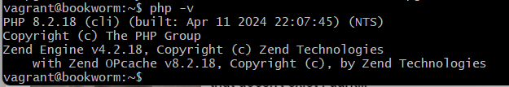
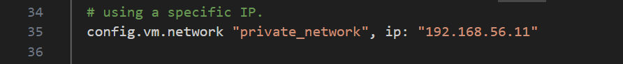

# Workshop 03 - Laravel

## Preambule

We make sure to have the server running with:

```bash
vagrant up
```

### Installing dependencies

There are a few dependencies we need first to continue working, we can install them with:

```bash
sudo apt-get update
sudo apt-get install vim vim-nox curl apache2 mariadb-client php8.2 php8.2-curl php8.2-bcmath php8.2-mysql php8.2-mcrypt php8.2-xml php8.2-zip php8.2-mbstring
php -v
```
The last command is so we can confirm the correct instalation of php.



## Creating the database

To create a database we must first create a folder for it, this will be done on the VMs folder, if we have the terminal on the previous step, then the command line should look something like this:

```bash
vagrant@bookworm:~$ exit
logout

pamel@SuperPCG3000 MINGW64 ~/Documents/Universidad/CuatrimestreII2024/Programación_con_Software_Libre/Workshops/VMs/webserver (master)
$ cd ..

pamel@SuperPCG3000 MINGW64 ~/Documents/Universidad/CuatrimestreII2024/Programación_con_Software_Libre/Workshops/VMs (master)
$ ls
webserver/

pamel@SuperPCG3000 MINGW64 ~/Documents/Universidad/CuatrimestreII2024/Programación_con_Software_Libre/Workshops/VMs (master)
$ mkdir database

pamel@SuperPCG3000 MINGW64 ~/Documents/Universidad/CuatrimestreII2024/Programación_con_Software_Libre/Workshops/VMs (master)
$ ls
database/  webserver/
```

To create a vagrant file, we must specify the register, the version and the arquitecture this way:

```bash
vagrant init debian/bookworm646
code Vagrantfile
```

On that file, on line 35, we must de-comment the line and change the ip to something more useful to us.



### Changing the hostname

With this, we can start vagrant and change the host name to avoid confusion.

```bash
sudo hostnamectl set-hostname database
vagrant@bookworm:~$ sudo nano /etc/hosts
```

The second line is to access another file necessary to change the hostname.
On the second row, right column there is a text "hostname", that will be changed into whatrever it is you want.


The same is done for the webserver.

### Installing server dependencies

In vagrant@database, we use the following command to install the necessary packages

```bash
sudo apt-get update
sudo apt-get install mariadb-server mariadb-client
```
Having this installed, we can use the command `sudo mysql` to connect to mysql


### Creating a database and user

```bash
create database lfts;
create user laravel identified by 'secret';
grant all privileges on lfts.* to laravel;
flush privileges;
```

With "lfts" "laravel" and "'secret'" being the database name, the username and the password, respectively.

## Habilitating database and webserver connection

```bash
sudo nano -l /etc/mysql/mariadb.conf.d/50-server.cnf
```

We comment line 27 to habilitate remote connections and then restart the machine to apply all changes.

```bash
sudo systemctl restart mysql
```

## Installing and configuring composer and node

### Composer
In the webserver we use the following commands

```bash
php -r "copy('https://getcomposer.org/installer', 'composer-setup.php');"
php -r "if (hash_file('sha384', 'composer-setup.php') === 'dac665fdc30fdd8ec78b38b9800061b4150413ff2e3b6f88543c636f7cd84f6db9189d43a81e5503cda447da73c7e5b6') { echo 'Installer verified'; } else { echo 'Installer corrupt'; unlink('composer-setup.php'); } echo PHP_EOL;"
php composer-setup.php
rm composer-setup.php


sudo mkdir -p /opt/composer
sudo mv composer.phar /opt/composer/
```

Having done this, the conexion is the only thing left

```bash
sudo ln -s /opt/composer/composer.phar /usr/local/bin/composer
```

This way, we can call for composer anywhere in our machine


### Node version manager


```bash
curl -o- https://raw.githubusercontent.com/nvm-sh/nvm/v0.39.7/install.sh | bash
exit
vagrant ssh
vmv -v
```

Now, that last line should give the version of the nvm installed.

### Node

```bash
nvm install --lts
```

## Manipulating a new project

Having done all that, we position ourselves in the correct workplace using `cd /vagrant/sites/`
In here, we'll create a new composer project.

```bash
composer create-project laravel/laravel:8.6.12 lfts.isw811.xyz
```


## Edit 'hosts' file

In a cmd in administration mode, we use the following commands to be able to edit the file

```bash
cd \
cd Windows\System32\drivers\etc
nodepad hosts
```
There, we'll add the following line

'192.168.56.10 lfts.isw811.xyz'

## Configuring virtual host

Now, we must create a copy of our previous conf file in webserver/confs and rename it lfts.isw811.xyz.conf. Inside, we must change all previous references to the website and add two instances of /public in lines 7 and 9, like this:


```bash
sudo cp lfts.isw811.xyz.conf /etc/apache2/sites-available
confs$ sudo apachectl -t
sudo a2ensite lfts.isw811.xyz.conf
confs$ sudo apachectl -t
sudo systemctl reload apache2
```

We should always make sure to receive both Syntax OK before continuing.
If done correctly, all of this should give us access to the web page in the browser


## Configuring laravel to allow for database

We'll have to access the .env file to change it. To do this, we position ourselves in webserver/sites/lfts.isw811.xyz and run the `code .env` file. In there, we'll change the following things:

1. On line 13 change the ip to 192.168.56.11
2. On line 14 change laravel to lfts
3. On line 15 change root to laravel
4. On line 16 add 'secret' as a password

Save it all and go run `php artisan migrate` on /vagrant/sites/lfts.isw811.xyz


___

Created by Pamela Murillo