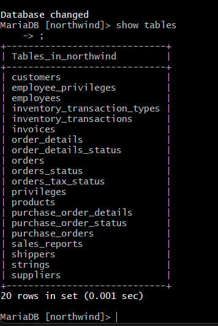
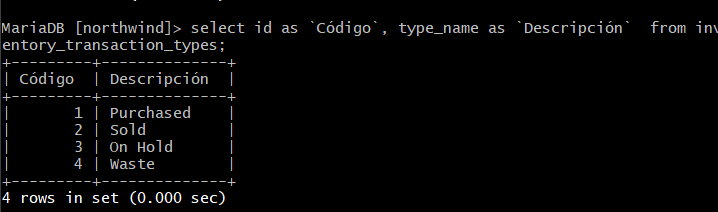
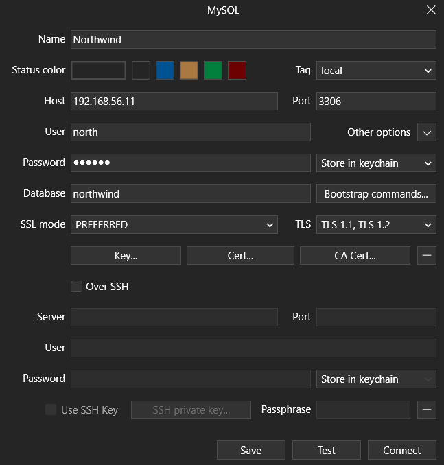
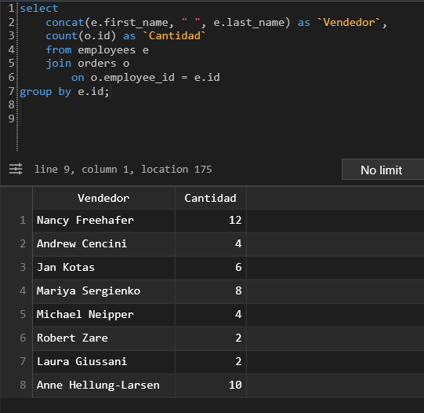
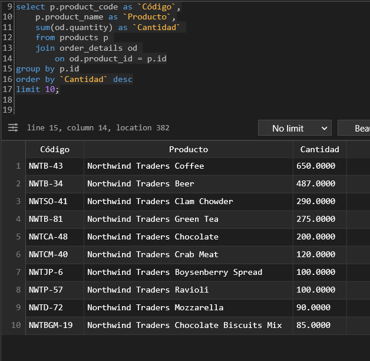
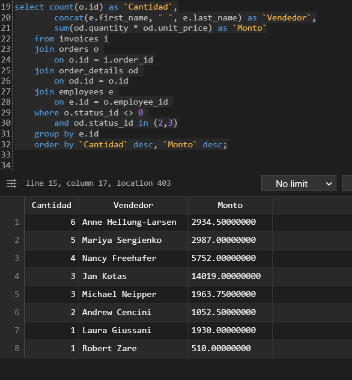
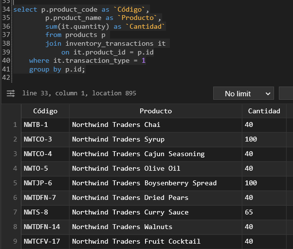
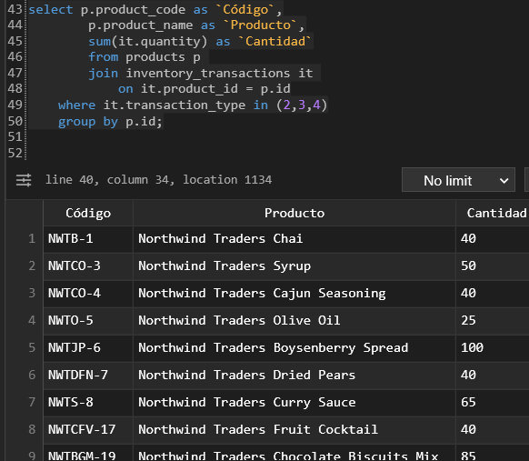
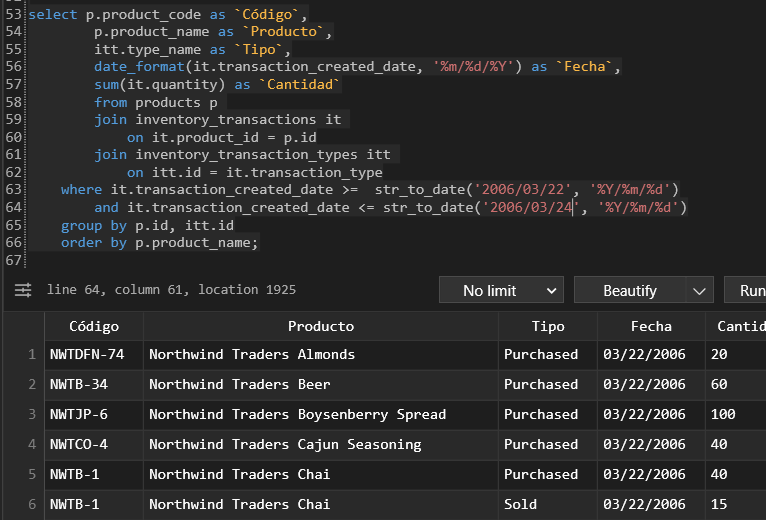
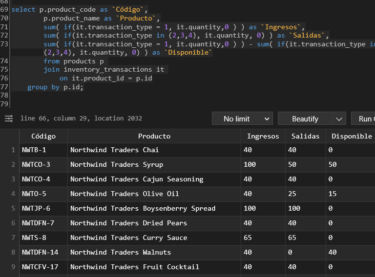

# Workshop 04 - Northwind

## Preambule

### Creating the database

The first step in this workshop is positioning ourselves in your database folder as we have been doing these past few times. In this folder, we'll have two important files with the northwind structure and data to work with.

While in `/vagrant` in the virtual machine, we must create a new database to pass our new data into. We create the database, the user and their access with:

```sql
create database northwind;
create user north identified by 'secret';
grant all privileges on northwind.* to north;
flush privileges;
```

The database's name, the user and the password can be whatever you want, of course.

### Organizing the database

Because we already have the database with use, it is only necessary to transfer the data with these command.

```bash
mysql northwind < northwind.sql -u north -p
```

To corroborate it works, we can enter as the north user and make a command like a select.



### Populating the database

As easy as before, we populate the tables now that we have them.

```bash
mysql northwind < northwind-data.sql -u north -p
```

## Challenge 01

'Recupere el código (id) y la descripción (type_name) de los tipos de transacciones de inventario (inventory_transaction_types).'

```sql
select id as `Código`, type_name as `Descripción`  from inventory_transaction_types;
```



### Interlude

Using the terminal is usually for more simple queries, to facilitate the work, I'll be using TablePlus with the following configuration:



## Challenge 02

'Recupere la cantidad total de ordenes (orders) registradas por cada vendedor (employees).'

```sql
select concat(e.first_name, " ", e.last_name) as `Vendedor`,
        count(o.id) as `Cantidad` 
        from employees e 
        join orders o 
            on o.employee_id = e.id
    group by e.id;
```



## Challenge 03

'Recupere la lista de los 10 productos «más ordenados»(order_details), y la
cantidad total de unidades ordenadas para cada uno de esos productos.'

```sql
select p.product_code as `Código`,
        p.product_name as `Producto`,
        sum(od.quantity) as `Cantidad` 
        from products p 
        join order_details od 
            on od.product_id = p.id
    group by p.id
    order by `Cantidad` desc
    limit 10;
```



## Challenge 04

'Recupere el monto total (invoices, orders,
order_details, products) y la cantidad de
facturas (invoices) por vendedor
(employee). Debe considerar solamente
las ordenes con estado diferente de 0 y
solamente los detalles en estado 2 y 3,
debe utilizar el precio unitario de las
lineas de detalle de orden, no considere el
descuento, no considere los impuestos,
porque la comisión a los vendedores se
paga sobre el precio base.'

```sql
select count(o.id) as `Cantidad`,
		concat(e.first_name, " ", e.last_name) as `Vendedor`,
		sum(od.quantity * od.unit_price) as `Monto`
        from invoices i
        join orders o 
            on o.id = i.order_id
        join order_details od 
            on od.id = o.id
        join employees e 
            on e.id = o.employee_id 
	where o.status_id <> 0 
		and od.status_id in (2,3)
	group by e.id
	order by `Cantidad` desc, `Monto` desc;
```



## Challenge 05

'Recupere los movimientos de inventario del tipo ingreso. Tomando como base todos los
movimientos de inventario (inventory_transactions), considere unicamente el tipo de
movimiento 1 (transaction_type) como ingreso.'

```sql
select p.product_code as `Código`,
		p.product_name as `Producto`,
		sum(it.quantity) as `Cantidad`
		from products p 
		join inventory_transactions it 
			on it.product_id = p.id
	where it.transaction_type = 1
	group by p.id;
```



## Challenge 06

'Recupere los movimientos de inventario del tipo salida. Tomando como base todos los
movimientos de inventario (inventory_transactions), considere unicamente los tipos de
movimiento (transaction_type) 2, 3 y 4 como salidas.

Debe agrupar por producto (products) y deberá incluir como mínimo los campos de código (product_code),
nombre del producto (product_name) y la cantidad de unidades que salieron.'

```sql
select p.product_code as `Código`,
		p.product_name as `Producto`,
		sum(it.quantity) as `Cantidad`
		from products p 
		join inventory_transactions it 
			on it.product_id = p.id
	where it.transaction_type in (2,3,4)
	group by p.id;
```



## Challenge 07

'Genere un reporte de movimientos de inventario (inventory_transactions) por producto
(products), tipo de transacción y fecha, entre las fechas 22/03/2006 y 24/03/2006
(incluyendo ambas fechas).

Debe incluir como mínimo el código (product_code), el nombre del producto (product_name), la fecha truncada
(transaction_created_date), la descripción del tipo de movimiento (type_name) y la suma de cantidad (quantity).'

```sql
select p.product_code as `Código`,
		p.product_name as `Producto`,
		itt.type_name as `Tipo`,
		date_format(it.transaction_created_date, '%m/%d/%Y') as `Fecha`,
		sum(it.quantity) as `Cantidad`
		from products p 
		join inventory_transactions it 
			on it.product_id = p.id
		join inventory_transaction_types itt 
			on itt.id = it.transaction_type
	where it.transaction_created_date >=  str_to_date('22/03/2006', '%d/%m/%Y')
		and it.transaction_created_date <= str_to_date('24/03/2006', '%d/%m/%Y')
	group by p.id, itt.id
	order by p.product_name;
```



## Challenge 08

'Genere la consulta SQL para un reporte de inventario, tomando como base todos los
movimientos de inventario (inventory_transactions), considere los tipos de movimiento
(transaction_type) 2, 3 y 4 como salidas y el tipo 1 como ingreso.

Este reporte debe estar agrupado por producto (products) y deberá incluir como mínimo los
campos de código (product_code), nombre del producto (product_name) y la sumarización
de ingresos, salidas y la cantidad disponible en inventario (diferencia de ingresos - salidas).'

```sql
select p.product_code as `Código`,
		p.product_name as `Producto`,
		sum( if(it.transaction_type = 1, it.quantity,0 ) ) as `Ingresos`,
		sum( if(it.transaction_type in (2,3,4), it.quantity, 0) ) as `Salidas`,
		sum( if(it.transaction_type = 1, it.quantity,0 ) ) - sum( if(it.transaction_type in (2,3,4), it.quantity, 0) ) as `Disponible`
		from products p 
		join inventory_transactions it 
			on it.product_id = p.id
	group by p.id;
```


___

Created by Pamela Murillo