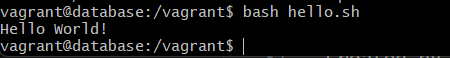

# Workshop 05 - Dot Files, Bash Scripting and Cronjobs

## Why Scripting?

There are certain actinos that we can do in the terminal that could and should be automatically triggered, be it by the time of the day or by an external process. This could be anywhere from a database backup to a daily report of tables in a database.

## How This Works

We can test how a script works by creating one in our host machine, inside of our database folder using:

```bash
touch hello.sh
chmod +x hello.sh
code hello.sh
```

Touch creates the file and chmod gives it execution rights.

Code is only to open it using Visual Studio Code, but we can do it manually or edit it using other means.

### Inside our sh file

Every bash file starts with `#!bin/bash`, this is just to indicate to the interpreter the language we're using.

To test it, we can use a simple `echo "Hello World!"` and try to run it.

### Actually Running It

Now, running a file in the . directory is not as easy as it seems, for we can only run files that are explicitly stated in the $PATH variable as a safety measure.

So, to run the program, we specify the directory: `./hello.sh`. This might behave differently in Windows, in my case I had to specify `bash hello.sh` for it to work, this is temporal however, for in other files the credentials are succesfully changed when I did it from the host machine.



## Continue With the Script

There are tons of things we can do with a bash script, for now, we can use a simple if.

```bash
#!bin/bash

echo "Please type your name"
read name

if [ -z "$name" ]; then
    echo "I would've loved to meet you"
else
    echo "Hello $name"
fi
```


With another file, we can tell the user their generation according to their birth year.

```bash
#!/bin/bash

echo "Please type your birth year:"
read year

if [[ -z "$year" ]]; then
    echo "You didn't type anything"
elif [[ ! "$year" =~ ^[0-9]{4}$ ]]; then
    echo "You should introduce an actual number"
elif [[ "$year" -lt 1900 && "$year" -gt 2025 ]]; then
    echo "The year must be between 1900 and 2024"
else 
    if [ "$year" -ge 1946 ] && [ "$year" -le 1964 ]; then
        echo "You're a Baby Boomer"
    elif [ "$year" -ge 1965 ] && [ "$year" -le 1980 ]; then
        echo "You're from the X Generation"
    elif [ "$year" -ge 1981 ] && [ "$year" -le 1996 ]; then
        echo "You're a Millenial"
    elif [ "$year" -ge 1997 ] && [ "$year" -le 2012 ]; then
        echo "You're from the Z Gen"
    elif [ "$year" -ge 2013 ]; then
        echo "You're from the Alpha Generation"
    else
        echo "We don't have a generation for you"
    fi
```


## Database Backups

To further explain one of the most important jobs of the scripts, we should do a basic backup. To do this, we'll create a new folder dedicated to it and the corresponding file inside of it:

```bash
mkdir backups\
cd backups
touch backup.sh
code backup.sh
```

Inside of our file, we'll run the following code:

```bash
#!/bin/bash

database="northwind"
username="north"
password="secret" # In a professional environment this should be obtained through a .env variable
directory="/vagrant/backups/"

cd $directory
mysqldump -u $username --password=$password $database > backup02.sql
```


This will create, unsurprisingly, a backup of the database northwind. A timestamp can also be saved by adding it to the variables: `timestamp=$(date +"%Y%m%d%H%M%S")` and introducing it as the name: `mysqldump -u $username --password=$password $database > ${database}_${timestamp}.sql`

### Hashing the Pasword

As said before in the script comments, we should not have our password out and about in the file, we should have it in our machines and our machines only.

To establish an environment password, we simply 'export' it: `export dbpassword=secret` and now we can use it in our script.

```bash
if [ -z  "$dbpassword" ]; then
    echo "Error: dbpassword does not exist"
    exit 1
fi
```

Make sure to change 'password' to 'dbpassword' in the command.


## Accepting more Arguments

We can add things to the file while running the command to run the file in our machines:

```bash
#!/bin/bash

database="northwind"
username="north"
directory="/vagrant/backups/"
timestamp=$(date +"%Y%m%d%H%M%S")
filename=$1

# Validate dbpassword configuration
if [ -z  "$dbpassword" ]; then
    echo "Error: dbpassword does not exist"
    exit 1
fi

# Validate new argument
if [ -z  "$1" ]; then
    filename=${database}_${timestamp}.sql
else
    filename=${database}_${filename}.sql
fi

cd $directory
mysqldump -u $username --password=$dbpassword $database > $filename
```

Here, we accept an argument for it to be the filename and we change it depending on whether or not the user introduced additional text while running the command.


Now, even though this database is very small, it is convenient for us to compress each and every backup we make or things could get heavy pretty easily. To do this, we can compress the original file and then remove it:

```bash
.
.
.

cd $directory
mysqldump -u $username --password=$dbpassword $database > $filename.sql

tar vcfz $filename.tar.gz $filename

rm $filename.sql
```

## Registering logs

Now, this is all important information and we should keep track of it using the very famous logs. To do this, we have been introduced to the concept of a function in bash this way:

```bash
log_message() {
    local MESSAGE=$1
    echo "$timestamp : $MESSAGE" >> $logfile
}
```

And then to call it we use `log_message "Message"` in all the places we consider them neccessary.


Additionally, we can print this logs on screen using a tee pipe:

```bash
log_message() {
    local MESSAGE=$1
    echo "$timestamp : $MESSAGE" | tee -a $logfile
}
```

## Executing this Automatically

To make a cronjob that does that when we want we go to `crontab -e` to see the file and add ,uncommented, of course, `51 23 23 07 2 dbpassword=secret /vagrant/backups/backup.sh tuesday23` this will add a new backup at 11:51 pm on the tuesday 23 of july. Furthermore, we can ask for a log on this adding after 'tuesday23' `>> /vagrant/backups/cron.sql 2>&1`


The date at which the backup is made can and should vary depending on the requirements that need to be met.

___

Created by Pamela Murillo