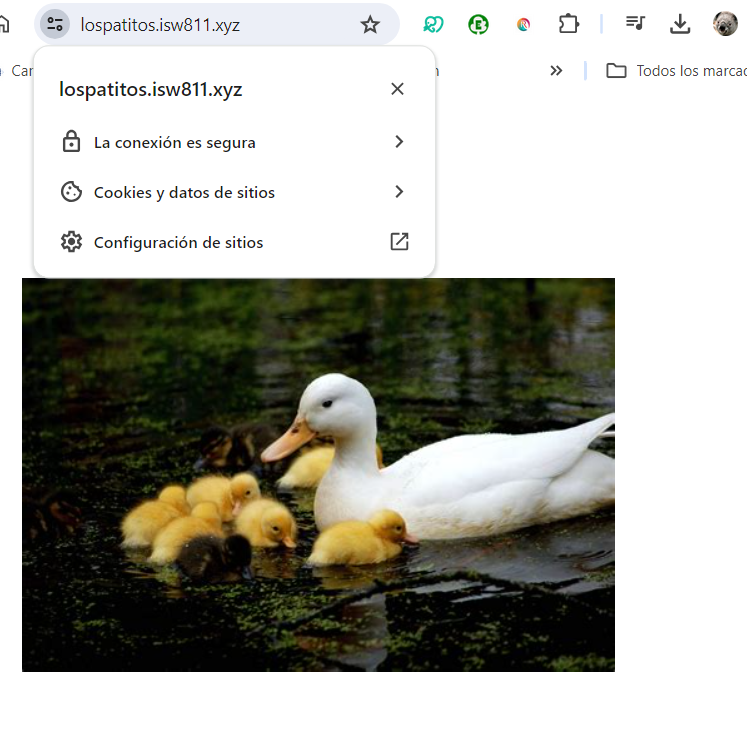
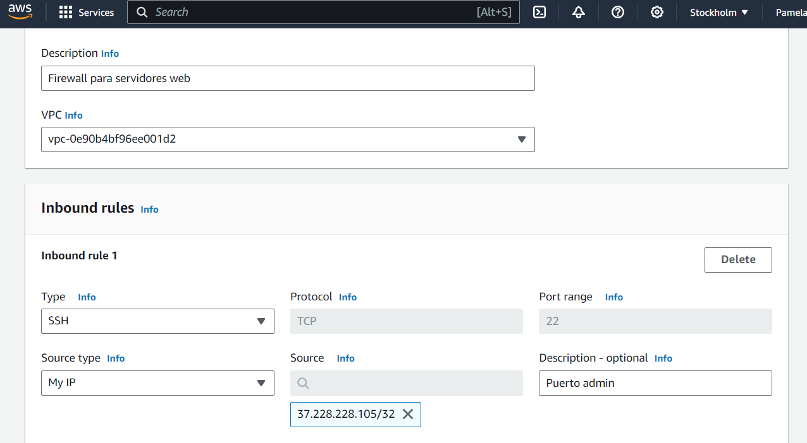
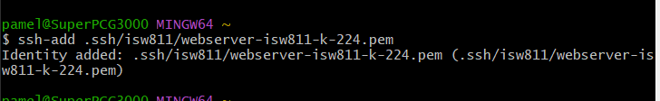

# Workshop 06 - Deploy a Web App using IaaS

## Buying a certificate

To be able to ask for a certificate we should install the following package in our virtual machine:

```bash
sudo apt-get install certbot
sudo certbot -d lospatitos.isw811.xyz --manual --preferred-challenges dns certonly
```

And then the challenge will arrise and it will ask for all the information necessary to identify you.

This will generate a record and a value to insert into Namecheap (or whatever page you're using for it) to confirm you're the owner of the site.

Make sure to wait a few minutes before pressing continue for the last time as to make sure the DNS has been successfully created.

### Changing the conf

Before going further, we must change a few things in our conf file that will make all requests pass through the https filter first. The changes will make the file look like this:

``` bash
<VirtualHost *:443>
  ServerAdmin webmaster@lospatitos.isw811.xyz
  ServerName lospatitos.isw811.xyz

  SSLEngine on
  SSLCertificateFile /etc/apache2/ssl/lospatitos.isw811.xyz/fullchain1.pem
  SSLCertificateKeyFile /etc/apache2/ssl/lospatitos.isw811.xyz/privkey1.pem
  SSLCertificateChainFile /etc/apache2/ssl/lospatitos.isw811.xyz/chain1.pem

  # Indexes + Directory Root.
  DirectoryIndex index.php index.html
  DocumentRoot /home/vagrant/sites/lospatitos.isw811.xyz

  <Directory /home/vagrant/sites/lospatitos.isw811.xyz>
      DirectoryIndex index.php index.html
      AllowOverride All
      Require all granted
  </Directory>

  ErrorLog ${APACHE_LOG_DIR}/lospatitos.isw811.xyz.error.log
  LogLevel warn
  CustomLog ${APACHE_LOG_DIR}/lospatitos.isw811.xyz.access.log combined
</VirtualHost>

<VirtualHost *:80>
    ServerName lospatitos.isw811.xyz
    DocumentRoot /home/vagrant/sites/lospatitos.isw811.xyz

    # Redireccionar todo el tráfico HTTP a HTTPS
    RewriteEngine On
    RewriteCond %{HTTPS} off
    RewriteRule ^(.*)$ https://%{HTTP_HOST}%{REQUEST_URI} [L,R=301]

    # Otras configuraciones específicas de tu sitio
</VirtualHost>
```

As we made changes, we need to habilitate the enmod and restart apache.

```bash
sudo a2enmod ssl
sudo cp confs/lospatitos.isw811.xyz.conf /etc/apache2/sites-available/
sudo systemctl restart apache2
```

### Apply the certificate

To see our keys we can go to `/etc/letsencrypt/archive/{{your_page}}#`

For now though, as we didn't make the certificate and only copied the password, we'll keep our keys in a new folder inside apache2 called ssl. To do this, we can position ourselves into apache2 or in the vagrant home and write:

```bash
sudo mkdir -p /etc/apache2/ssl/
sudo mv lospatitos.isw811.xyz / etc/apache2/ssl/
sudo chown root:root /etc/apache2/ssl/ -R
```

With that last command we're changing the owner of the folder and it's insides.



## Deploy an App using AWS

To use the services of Amazon we must first make an account and then determine which provider offers the best speed, in my case there is a provider in Ireland so the latency ranges from 30 to 90.

### Security Group

Knowing this, we'll make a new 'security group' with a few rules in it.




### Instances

We can make "virtual machines" using instances.

There is not much to explain in configuration, aside form the use of Debian and the upgrade from micro to small.

Now, we must make a new pair of ssh keys to use in our machine,a nd this step is really important.

We creaded a security group so we're gonna use it and then the storage will be 30 GB.

When the server is created we have to go to the .ssh located at the start of our host machine and move our generated key there. Meanwhile, we'll see that our IP is working so we'll use the following commands.

```bash
chmod 0400 ~/.ssh/isw811/webserver-isw811-k-224.pem
ssh-add ~/.ssh/isw811/webserver-isw811-k-224.pem
ssh admin@51.20.109.8 #or whatever your ip is
```



### Launch the App

To finally launch an app we have to make some prepations, like installing all the necessary dependencies and frameworks.

```bash
sudo apt-get update
sudo apt-get install apache2 vim vim-nox curl nano php8.2 php8.2-mbstring php8.2-mcrypt php8.2-curl php8.2-mysql mariadb-server mariadb-client
sudo a2enmod vhost_alias rewrite ssl
sudo systemctl restart apache2
```
#### Informing the register our web IP

We need to add the value IP of the AWS into the world wide web using namecheap or whatever it is you're using.

### Add something to the Page

We don't really need to make something new, we can go to our normal files and in confs and add the files with `scp lospatitos.isw811.xyz.conf admin@isw811.xyz` and `scp lospatitos.isw811.xyz.tar.gz admin@isw811.xyz`

Additionally, we can make a tar out of our webpage and paste it into our server using:

```bash
tar cvfz lospatitos.isw811.xyz-web.tar.gz lospatitos.isw811.xyz/
scp lospatitos.isw811.xyz-web.tar.gz admin@isw811.xyz:
```

In our external server we can decompress our tar files and copy, as usual, our conf site into the `/etc/apache2/sites-available` and see our page. (Don't forget to comment the previous IP in our hosts file)

## Stop the instance

Just for future references, we should stop the instance if we're not gonna use it.


___

Created by Pamela Murillo