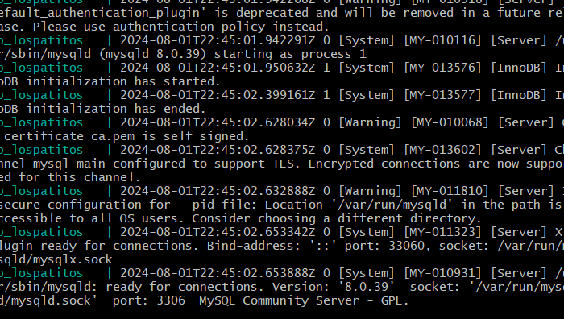

# Workshop 07 - Deploy a Web App Using Docker

## Creating a Docker Workspace

To generate a new virtual Docker we position ourselves into our VMs folder and write the following commands.

```bash
mkdir docker
cd docker
vagrant init debian/bookworm64
code Vagrantfile
```

Inside our file, we're gonna go to line 35 and change our virtual routers IP "192.168.56.12", making it look like this `config.vm.network "private_network", ip: "192.168.56.12"`. We also have to de-comment lines 59, 64, 65 and for a little more space we're gonna asign a different value to the memory on line 64: `vb.memory = "2048"`

This way we can try and ping it to see if it works:


## Connecting to Virtual Machine

Now, to alter the machine is the same process as every other, a simple vagrant ssh will work. Additionally, we should rename the VM.

```bash
vagrant ssh
sudo hostnamectl set-hostname docker
sudo nano /etc/hosts
## After changes
exit
vagrant ssh
```


## Installing Docker

Docker has a very usefull guide on how to install it on Debian, it contains the following commands.

```bash
sudo apt-get update
sudo apt-get install ca-certificates curl
sudo install -m 0755 -d /etc/apt/keyrings
sudo curl -fsSL https://download.docker.com/linux/debian/gpg -o /etc/apt/keyrings/docker.asc
sudo chmod a+r /etc/apt/keyrings/docker.asc

# Add the repository to Apt sources:
echo \
  "deb [arch=$(dpkg --print-architecture) signed-by=/etc/apt/keyrings/docker.asc] https://download.docker.com/linux/debian \
  $(. /etc/os-release && echo "$VERSION_CODENAME") stable" | \
  sudo tee /etc/apt/sources.list.d/docker.list > /dev/null

sudo apt-get update

sudo apt-get install docker-ce docker-ce-cli containerd.io docker-buildx-plugin docker-compose-plugin
```

And with that we should be ready to start creating containers.

## Authorize Users

A good practice in programming is to keep users authorized for certain tasks, in this instance, creating a container should not be an admin only job.

To authorize another user to create a container, we use `sudo gpasswd -a $USER docker`. And then we only have to restart the session.


We can even do a little hello world with docker `docker run hello-world`


## Conditioning our Workspace

In our host machine we'll position ourselves in the docker folder and run the following commands:

```bash
mkdir DockerWS
cd DockerWS
mkdir sites
mkdir proxy
cd ../
code Vagrantfile
```

And in the Vagrantfile we will add a line on the blank space in the 47 and write `config.vm.synced_folder "./DockerWS/sites", "/home/vagrant/sites", owner: "www-data", group: "www-data"`

To apply the changes, we halt and the up the machine.

## Creating a Site inside Docker

We might as well use a site we already have, so we're gonna copy and paste lospatitos to here. To do that, we position ourselves in ../docker/DockerWS/sites of our host machine and write:

```bash
cp -r ../../../webserver/sites/lospatitos.isw811.xyz/ .
mkdir public
mv * public
touch docker-compose.yml
code docker-compose.yml
```

Inside this file we're gonna declare all information necessary to start the container:

```yml
services:

  web_lospatitos:
    image: php:7.4-apache
    container_name: web_lospatitos
    hostname: web_lospatitos
    restart: always
    environment:
      DB_HOST: db_lospatitos
      DB_USER: $MYSQL_USER
      DB_PASSWORD: $MYSQL_PASSWORD
      DB_NAME: $MYSQL_DATABASE
    volumes:
      - ./public:/var/www/html
    networks:
      - net_isw811

  db_lospatitos:
    image: mysql:8.0
    container_name: db_lospatitos
    hostname: db_lospatitos
    restart: always
    env_file: .env
    volumes:
      - vol_lospatitos:/var/lib/mysql
    command: '--default-authentication-plugin=mysql_native_password'
    networks:
      - net_isw811

volumes:
  vol_lospatitos:

networks:
  net_isw811:
    external: true
```

### Creating an .env file

Pretty self-explanatory, we just create a .env file in the same folder as our docker-composer.yml and declare the constants.

```
MYSQL_USER=isw811
MYSQL_PASSWORD=secret
MYSQL_ROOT_PASSWORD=secret
MYSQL_DATABASE=lospatitos
```

## Create the Network

Connected to our virtual machine we write

```bash
docker network create net_isw811`
docker compose up
```




## Connect to an Apache Container

Now that we've done all that we can go into the docker virtual machine and open a command line in our apache server using `docker exec -it web_lospatitos bash`


We can also access the database, changing 'web_lospatitos' to 'db_lospatitos'


And create a database...

```bash
mysql -u root --password=$MYSQL_ROOT_PASSWORD
```


## Access the page

Every app has it's own port, in this case, our web can be temporarily placed on the port 8080 so that's what we're gonna look for in the search.


### By Proxy

Let's get in the proxy folder and run the following commands:

```bash
mkdir nginx_configs
touch nginx_configs/default.conf
touch nginx_configs/lospatitos.isw811.xyz.conf
code .
```

In the lospatitos.isw811.xyz.conf file we'll write:

```
upstream web_lospatitos {
    server web_lospatitos:80;
}

server {
    listen 443 ssl;
    server_name lospatitos.isw811.xyz;

    ssl_certificate /etc/ssl/certs/nginx/lospatitos.isw811.xyz/cert.pem;
    ssl_certificate_key /etc/ssl/certs/nginx/lospatitos.isw811.xyz/privkey.pem;

    proxy_set_header Host $host;
    proxy_set_header X-Forwarded-Proto $scheme;

    location / {
        proxy_pass http://web_lospatitos;
    }
}

server {
    listen 80;
    server_name lospatitos.isw811.xyz;
    return 301 https://$server_name$request_uri;
}
```

And in the default.conf

```
server {

    listen 80;

    location / {
        root    /usr/share/nginx/html;

        index   index.html index.htm;
    }

}
```

In that same level of nginx_configs folder we'll create another two folders 'ssl' and 'default_site', as well as another docker-compose.yml.

#### Docker-compose.yml

```
services:
  proxy:
    image: nginx:1-alpine
    container_name: web_proxy
    hostname: web_proxy
    volumes:
      - ./nginx_configs/:/etc/nginx/conf.d/:ro
      - ./ssl:/etc/ssl/certs/nginx/:ro
      - ./default_site/:/usr/share/nginx/html/:ro
    ports:
      - "443:443"
      - "80:80"
    networks:
      - net_isw811

networks:
  net_isw811:
    external: true
```
#### SSL

```bash
mkdir
mkdir -p ssl/lospatitos.isw811.xyz
```
And inside of it we should have all our ssl files and keys.


#### Default_site

This will only have an inde.html file with nothing much on it.

## Including the Page

To see the page by its domain we add the IP into our hosts file


And see it in the web


___

Created by Pamela Murillo